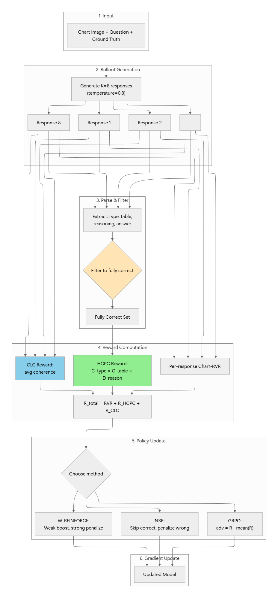

# ChartQA Evaluation Comparison: Base Qwen vs GRPO Qwen vs GRPO-HCPC Qwen

## Overview

This document compares three Qwen2.5-VL-3B-Instruct variants on the ChartQA test split:

1. Base Qwen
2. GRPO-trained Qwen
3. GRPO-HCPC-trained Qwen

The goal is to summarize the experimental setup, compare the observed results, and explain why the models behaved this way.

  

## Source Runs

- Base: `app/outputs/eval_results/main_base_chartqa_20260218_210622/summary.json`
- GRPO baseline: `app/outputs/eval_results/grpo_baseline_checkpoint-2000_chartqa_20260219_073124/summary.json`
- GRPO baseline verification: `app/outputs/eval_results/grpo_baseline_checkpoint-2000_chartqa_20260219_073124/per_sample.jsonl`
- GRPO-HCPC: `app/outputs/eval_results/grpo_hcpc_updated_checkpoint-2000_chartqa_20260301_170306/summary.json`

## Experimental Setup

### Base model

- Backbone: `Qwen/Qwen2.5-VL-3B-Instruct`
- Task: chart question answering with structured reasoning output
- Output format expected by the evaluator:
  - `<think>`
  - `<type>...</type>`
  - `<table>...</table>`
  - stepwise reasoning
  - `</think>`
  - `<answer>...</answer>`

### Evaluation setup

- Dataset: `chartqa`
- Split: `test`
- Evaluated subset size: `500`
- Decoding:
  - temperature = `0.8`
  - top-p = `0.95`
  - max new tokens = `768`
- Multi-rollout metrics:
  - `pass@1`, `pass@2`, `pass@4`
  - `d_reason`: diversity of reasoning among correct rollouts
  - `correct_rate`: fraction of correct rollouts
  - `format_compliance_rate`: fraction of first responses that fully follow the required output format

### Training setup for the two RL models

From the saved training configs:

- Policy method: `GRPO`
- Epochs: `2`
- Batch size: `2`
- Gradient accumulation: `2`
- Learning rate: `1e-5`
- LoRA:
  - rank `8`
  - alpha `16`
  - dropout `0.05`
  - target modules: `q_proj`, `v_proj`
- Training subset size: `1000`
- Number of rollouts during training: `4`

### Reward difference between GRPO baseline and GRPO-HCPC

GRPO baseline uses the base Chart-RVR-style reward stack, including:

- format reward
- answer accuracy reward
- length reward
- token-count reward
- chart-type reward
- table reward
- process reward

GRPO-HCPC changes the objective:

- `process_reward` is disabled
- `HCPC` is enabled
- HCPC rewards:
  - high chart-type consistency among correct rollouts
  - high table consistency among correct rollouts
  - high reasoning diversity among correct rollouts

In short:

- GRPO baseline tries to match the expected reasoning path more directly
- GRPO-HCPC tries to encourage multiple valid correct reasoning paths while keeping chart type and table extraction stable

## Important Evaluation Note

The GRPO baseline `summary.json` contains a stale `pass@8` entry caused by a resume mismatch. Per your instruction, that value is ignored here.

For fairness, the GRPO baseline comparison below uses the verified 4-rollout data from `per_sample.jsonl`, which matches the evaluator log (`Rollouts: 4`).

## Quantitative Results

| Model | Pass@1 | Pass@2 | Pass@4 | D_reason | Correct rate | Format rate |
|---|---:|---:|---:|---:|---:|---:|
| Base Qwen | 0.5245 | 0.6733 | 0.7740 | 0.0400 | 0.5245 | 0.2980 |
| GRPO Qwen | 0.6188 | 0.7310 | 0.8031 | 0.0579 | 0.6188 | 0.9680 |
| GRPO-HCPC Qwen | 0.6285 | 0.7457 | 0.8280 | 0.0521 | 0.6540 | 0.9820 |

## Main Findings

### 1. Both RL-trained models clearly outperform the base model

Compared with base Qwen:

- Both RL models dramatically improve formatting:
  - Base: `29.8%`
  - GRPO: `96.8%`
  - GRPO-HCPC: `98.2%`
- Both RL models improve multi-rollout success:
  - Base `pass@4 = 0.7740`
  - GRPO `pass@4 = 0.8031`
  - GRPO-HCPC `pass@4 = 0.8280`
- Both RL models also increase correct-rollout rate:
  - Base `0.5245`
  - GRPO `0.6188`
  - GRPO-HCPC `0.6540`

This indicates that RL training strongly helped the model internalize the required answer structure and improve the overall quality of sampled rollout sets.

### 2. GRPO-HCPC is best on multi-rollout success

GRPO-HCPC has the best `pass@1`, `pass@2`, and `pass@4`:

- `pass@1 = 0.6285`
- `pass@2 = 0.7457`
- `pass@4 = 0.8280`

This is especially important because HCPC is designed around cross-rollout behavior. The result suggests that HCPC improves the overall quality of the rollout set, even if the very first rollout is not always the single strongest one.

### 3. GRPO-HCPC has the highest correct-rollout rate

- Base: `0.5245`
- GRPO: `0.6188`
- GRPO-HCPC: `0.6540`

This is one of the strongest signals in favor of HCPC. It means that, across generated candidates, HCPC produces correct answers more often.

That aligns well with the intended HCPC design: reward groups of correct rollouts that are consistent on chart type and table extraction while allowing reasoning variation.

### 4. D_reason did not increase under HCPC, but the gap is small

- GRPO: `0.0579`
- GRPO-HCPC: `0.0521`

This does not mean HCPC failed. HCPC does not optimize `d_reason` by itself. It optimizes a joint objective that balances:

- correctness of rollouts
- consistency of chart type
- consistency of table extraction
- diversity of reasoning

So the model can improve the overall HCPC objective by becoming more reliable and structurally stable, even if reasoning diversity alone is slightly lower. On this experiment, that is exactly what the results suggest: HCPC produced better rollout robustness and better correct-rollout coverage, while `d_reason` stayed close to the GRPO baseline rather than exceeding it.

## Analysis: Why the Results Look Like This

### Why both RL models beat base Qwen

The base model starts from a general-purpose instruction-following checkpoint. It can answer many questions correctly, but it was not specifically optimized for:

- strict XML-like structured output
- explicit chart type prediction
- table extraction in the required JSON schema
- stable chart reasoning under repeated stochastic sampling

After GRPO training, the model receives repeated reward pressure on exactly these behaviors. That explains the large gains in:

- format compliance
- multi-sample success rate
- correct-rollout rate

### Why HCPC wins on pass@k and correct rate

HCPC explicitly rewards correct-rollout groups that are:

- consistent in chart type
- consistent in table extraction
- diverse in reasoning

This can improve robustness under sampling. Instead of collapsing to one narrow reasoning pattern, the model learns that several reasoning paths are acceptable if they preserve the important intermediate structure.

That makes it more likely that at least one or more rollouts in a sampled set are correct, which is exactly what `pass@k` and `correct_rate` capture.

### Why D_reason is slightly lower for HCPC

This is the main subtle result in the table. HCPC includes reasoning diversity, but only as one term inside a weighted multi-objective reward. If the model learns a few safer reasoning templates that repeatedly produce correct and structurally valid outputs, total reward can still increase even if measured reasoning diversity drops slightly.

So the observed pattern is coherent:

- HCPC improves `pass@k`
- HCPC improves `correct_rate`
- HCPC improves `format_compliance`
- HCPC does not produce the highest `d_reason`

That means the training objective favored more reliable correct rollout sets over maximally varied reasoning traces.

## Overall Interpretation

If the goal is stronger structured generation quality and more robust multi-rollout behavior, GRPO-HCPC is the better model in this comparison because it gives:

- best `pass@k`
- best correct-rollout rate
- best format compliance

This is a favorable result for the HCPC thesis argument. HCPC does not need to beat the baseline on every scalar metric to be useful. Its value is that it shifts the model toward more reliable rollout sets and more controllable structured chart reasoning.

## Conclusion

The experiment shows three clear outcomes:

1. RL training is effective for chart reasoning with Qwen2.5-VL-3B-Instruct.
2. Standard GRPO and GRPO-HCPC both strongly outperform the base model on rollout quality metrics.
3. GRPO-HCPC gives the best overall rollout robustness, with the strongest `pass@k`, `correct_rate`, and format compliance.

So the most defensible thesis claim here is that HCPC improves structured reasoning reliability and candidate-set quality, especially when evaluation is framed around multiple sampled rollouts rather than a single response.
