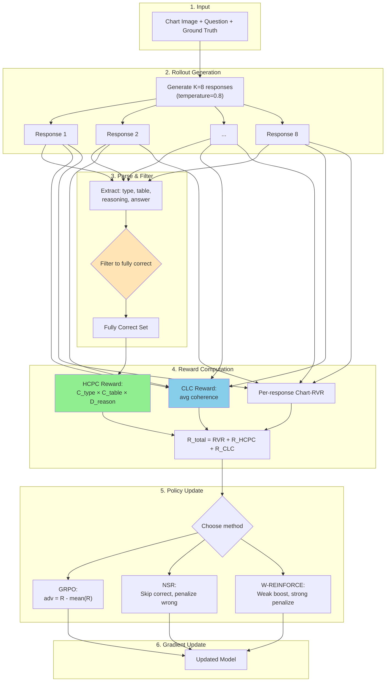

# HCPC-RLVR: Hierarchical Correct-Path Consistency for Robust Chart Reasoning

## Abstract

**HCPC-RLVR**, a reinforcement learning framework for training vision-language models on chart reasoning tasks. Our approach addresses two key problems: (1) **reasoning collapse**, where models converge to a single reasoning strategy and fail on out-of-distribution charts, and (2) **hallucinated reasoning**, where models produce correct answers through fabricated intermediate steps. We tackle these by systematically comparing three policy update methods—GRPO, NSR, and W-REINFORCE—and introducing two novel rewards: **Hierarchical Correct-Path Consistency (HCPC)** that enforces level-specific objectives (consistent extraction, diverse reasoning), and **Cross-Level Coherence (CLC)** that verifies reasoning actually references extracted data.

---

## 1. Problem Statement

### 1.1 The Reasoning Collapse Problem

Standard reinforcement learning (GRPO) for chart reasoning works as follows:

1. Generate multiple responses for each question
2. Reward correct answers, penalize wrong ones
3. Update the model to increase probability of rewarded responses

**The problem:** This causes the model to collapse to a single "winning" reasoning strategy. While this maximizes training accuracy, it hurts generalization—when the model encounters charts with different visual styles (colors, layouts, fonts), its single memorized strategy fails.

**Evidence:** Chart-RVR reports 84.6% on ChartQA (in-domain) but only 53.4% on EvoChart (out-of-distribution)—a 31% gap.

### 1.2 The Hallucinated Reasoning Problem

Even when models get the right answer, they may do so for wrong reasons:

```
Extracted table: {2020: 100, 2021: 150}
Reasoning: "The values are 80 and 170, so 80+170 = 250"
Answer: 250 ✓

```

The answer is correct, but the reasoning references values (80, 170) that don't appear in the extracted table. This is **hallucinated reasoning**—the model is "right for wrong reasons" and will fail unpredictably on new data.

### 1.3 The Key Insight: Chart Reasoning Has Hierarchical Structure

Prior diversity methods treat all reasoning levels uniformly. But chart reasoning has different requirements at each level:

| Level | Task | Desired Property |
| --- | --- | --- |
| **Perception** | Identify chart type | **Consistent** (one correct type) |
| **Extraction** | Parse data into table | **Consistent** (one correct table) |
| **Reasoning** | Compute/analyze | **Diverse** (multiple valid strategies) |
| **Answer** | Final response | **Consistent** (one correct answer) |

**Key insight**: We should enforce *different objectives at different levels*—consistency for extraction, diversity for reasoning.

### 1.4 Our Solution

We address these problems through three mechanisms:

1. **Alternative policy update methods (NSR, W-REINFORCE):** Modify gradient flow to preserve diversity
2. **Hierarchical Correct-Path Consistency (HCPC):** Reward consistent extraction + diverse reasoning among ground-truth-correct rollouts
3. **Cross-Level Coherence (CLC):** Verify that reasoning actually references values from the extracted table

---

## 2. Background: Policy Update Methods

### 2.1 GRPO (Group Relative Policy Optimization)

GRPO is the standard method used in Chart-RVR. For each question, it:

1. Generates K responses (rollouts)
2. Computes reward for each response
3. Calculates advantage as deviation from mean: `adv_i = R_i - mean(R)`
4. Updates all responses: increases probability of above-average, decreases below-average

**Problem:** Strong positive reinforcement of the best response causes other valid strategies to be suppressed. Over time, the model converges to producing nearly identical outputs.

### 2.2 NSR (Negative Sample Reinforcement)

NSR was proposed for math reasoning and modifies GRPO by:

1. **Skipping correct samples entirely** (no gradient)
2. **Only penalizing wrong samples:** `adv_i = -(1 - R_i)`

**Why this helps:** By not reinforcing correct answers, NSR doesn't push the model toward any single correct strategy. It only pushes *away* from wrong strategies, allowing the probability mass to redistribute naturally across all valid approaches.

**Trade-off:** May have slightly lower peak accuracy since correct answers aren't explicitly reinforced.

### 2.3 W-REINFORCE (Weighted REINFORCE)

W-REINFORCE is a hybrid approach:

1. **Weak positive reinforcement for correct samples:** `adv_i = λ × R_i` (where λ = 0.1)
2. **Strong negative reinforcement for wrong samples:** `adv_i = -(1 - R_i)`

**Why this helps:** Provides a small boost to correct answers (maintaining accuracy) while keeping the strong penalty for wrong answers. The asymmetry (weak positive, strong negative) preserves more diversity than GRPO while being more directed than pure NSR.

### 2.4 Method Comparison

| Method | Correct Samples | Wrong Samples | Diversity | Accuracy |
| --- | --- | --- | --- | --- |
| **GRPO** | Strong boost | Penalize | Low (collapses) | High in-domain |
| **NSR** | Skip (no gradient) | Penalize | High (preserved) | Slightly lower |
| **W-REINFORCE** | Weak boost (λ=0.1) | Strong penalize | Medium | Balanced |

**Key insight:** These methods have only been tested on text-based math reasoning. Chart reasoning involves visual perception + numerical reasoning, which may respond differently to these training strategies.

---

## 3. Our Contribution: HCPC + CLC

### 3.1 Hierarchical Correct-Path Consistency (HCPC)

**Motivation:** The policy update methods above preserve diversity *passively* (by not destroying it). We propose to encourage the *right kind* of diversity *actively* through an explicit reward signal that respects the hierarchical structure of chart reasoning.

**Core idea:** Measure cross-rollout properties at each level with level-specific objectives:

```
Chart Image → [Type ID] → [Table Extraction] → [Reasoning] → Answer
                 ↓              ↓                  ↓
            CONSISTENT      CONSISTENT          DIVERSE

```

### 3.2 HCPC Formula

**Step 1: Filter to Ground-Truth-Correct Rollouts**

Unlike inference-time self-consistency (majority voting), we anchor to ground truth since labels are available during training:

```
fully_correct = {r ∈ rollouts :
    r.type = GT.type AND
    r.answer = GT.answer AND
    similarity(r.table, GT.table) > 0.8}

```

**Why strict filtering?**

- Prevents rewarding "lucky guesses" (wrong table → right answer by chance)
- Ensures we measure properties among truly correct solutions

**Step 2: Measure Level-Specific Properties (among correct rollouts only)**

**C_type (Type Consistency):**

```
C_type = fraction of rollouts matching modal type

```

- Want: HIGH (all should identify same chart type)

**C_table (Table Consistency):**

```
C_table = average pairwise similarity of extracted tables

```

- Want: HIGH (all should extract same data)

**D_reason (Reasoning Diversity):**

```
D_reason = 1 - average pairwise similarity of reasoning traces

```

- Want: HIGH (different strategies to reach correct answer)

**Step 3: Combine into HCPC Reward**

```
R_HCPC = (|fully_correct| / K) × (w₁·C_type + w₂·C_table + w₃·D_reason)

```

Where w₁ = 1.0, w₂ = 2.0 (table most important), w₃ = 1.5.

**Interpretation:**

| C_table | D_reason | R_HCPC | Meaning |
| --- | --- | --- | --- |
| High | High | **High** | Same data, different strategies (robust!) |
| High | Low | Medium | Same data, same strategy (fragile) |
| Low | High | Low | Different data, different strategies (lucky guesses) |
| Low | Low | Low | Confused model |

### 3.3 Cross-Level Coherence (CLC)

**Motivation:** HCPC measures properties at each level independently. But it doesn't verify that levels are *internally consistent*. CLC catches hallucinated reasoning where the model produces correct answers via fabricated intermediate steps.

**CLC Formula:**

For each rollout, measure whether reasoning references values from the extracted table:

```
C_coherence = |values_in_reasoning ∩ values_in_table| / |values_in_reasoning|

```

- Extract numerical values mentioned in reasoning trace
- Check how many appear in the extracted table
- High coherence = reasoning uses extracted data
- Low coherence = reasoning is fabricated

**Example:**

```
Table: {2020: 100, 2021: 150}
Reasoning: "Adding 100 and 150 gives 250"
Values in reasoning: {100, 150, 250}
Values in table: {100, 150}
Overlap: {100, 150}
C_coherence = 2/3 = 0.67 (good—references actual extracted values)

```

**CLC Reward:**

```
R_CLC = w_clc × mean(coherence across all rollouts)

```

Where w_clc = 1.0.

**What CLC Catches That HCPC Doesn't:**

| Scenario | HCPC | CLC |
| --- | --- | --- |
| Correct answer, correct reasoning | High | High |
| Correct answer, fabricated reasoning | High | **Low** |
| Wrong answer, coherent reasoning | Low | High |
| Wrong answer, fabricated reasoning | Low | Low |

### 3.4 Why This is Novel

| Aspect | Self-Consistency | Chart-RVR | Diversity Rewards | **HCPC + CLC (Ours)** |
| --- | --- | --- | --- | --- |
| Levels | Single (answer) | Multi | All | Multi |
| Measurement | Cross-rollout | Per-rollout | Cross-rollout | Cross-rollout |
| Objective | Uniform agreement | Independent | Uniform diversity | **Level-specific** |
| Filtering | Majority vote | None | None | **Ground truth** |
| Coherence check | No | No | No | **Yes (CLC)** |
| Stage | Inference | Training | Training | Training |

---

## 4. Complete Pipeline

### 4.1 Architecture Overview



### 4.2 Step-by-Step Walkthrough

**Step 1: Input**

- Chart image (e.g., a bar chart showing sales by year)
- Question (e.g., "What is the total sales for 2020 and 2021?")
- Ground truth: type='bar', table={(2020,100), (2021,150)}, answer=250

**Step 2: Generate K=8 Rollouts**

- Temperature=0.8 encourages diversity
- Each response contains type, table, reasoning, and answer

**Step 3: Filter to Fully Correct (Ground-Truth Anchored)**

| Rollout | Type | Table | Answer | Status |
| --- | --- | --- | --- | --- |
| 1 | bar ✓ | {2020:100, 2021:150} ✓ | 250 ✓ | **Fully Correct** |
| 2 | bar ✓ | {2020:100, 2021:150} ✓ | 250 ✓ | **Fully Correct** |
| ... | ... | ... | ... | ... |
| 7 | bar ✓ | {2020:95, 2021:155} ✗ | 250 ✓ | Rejected (wrong table) |
| 8 | line ✗ | {2020:100, 2021:150} ✓ | 250 ✓ | Rejected (wrong type) |

**Step 4: Compute Rewards**

*HCPC (among fully correct only):*

- C_type = 1.0 (all identified "bar")
- C_table = 1.0 (all extracted same table)
- D_reason = 0.65 (reasoning traces ~35% similar)
- rate = 6/8 = 0.75
- R_HCPC = 0.75 × (1.0 + 2.0 + 0.975) = 2.98

*CLC (all rollouts):*

- Check if each rollout's reasoning references its extracted table values
- Rollout 8: reasoning mentions 80, 170 (not in table) → coherence = 0
- R_CLC = mean coherence = 0.67

*Total:*

```
R_total[i] = R_base[i] + R_HCPC + R_CLC

```

**Step 5: Policy Update**

Choose one of three methods:

*GRPO:*

```python
baseline = mean(R_total)
for i in range(K):
    advantage[i] = R_total[i] - baseline

```

*NSR:*

```python
threshold = 0.8 * max_possible_reward
for i in range(K):
    if R_total[i] >= threshold:
        continue  # Skip correct samples
    advantage[i] = -(1 - R_total[i] / max_possible_reward)

```

*W-REINFORCE:*

```python
threshold = 0.8 * max_possible_reward
for i in range(K):
    if R_total[i] >= threshold:
        advantage[i] = 0.1 * R_total[i]  # Weak positive
    else:
        advantage[i] = -(1 - R_total[i] / max_possible_reward)  # Strong negative

```

**Step 6: Gradient Update**

```python
loss = -sum(advantage[i] * log_prob(response[i]) for i in range(K))
loss.backward()
optimizer.step()

```

---

## 5. Experimental Design

### 5.1 Configuration

| Parameter | Value | Rationale |
| --- | --- | --- |
| Model | Qwen2.5-VL-3B-Instruct | Standard VLM for chart tasks |
| Training Data | ChartQA + PlotQA (1K) | Compute constraints |
| K (rollouts) | 8 | Balance diversity and compute |
| Learning Rate | 5e-7 | Stable fine-tuning |
| Epochs | 3 | Convergence observed |
| Temperature | 0.8 | Encourage diverse generation |
| HCPC weights | w₁=1.0, w₂=2.0, w₃=1.5 | Table > Diversity > Type |
| CLC weight | w_clc=1.0 | Coherence importance |
| W-REINFORCE λ | 0.1 | From original paper |
| Table sim threshold | 0.8 | Strict filtering |

### 5.2 Evaluation

**Datasets:**

- **ChartQA (in-domain):** Similar visual style to training data
- **EvoChart (out-of-distribution):** Diverse chart styles not seen in training

**Metrics:**

- **Accuracy:** Percentage of correct answers
- **C_table:** Extraction consistency among correct rollouts
- **D_reason:** Reasoning diversity among correct rollouts
- **Coherence:** Average CLC score
- **OOD Gap:** In-domain accuracy minus OOD accuracy (lower = better)

### 5.3 Experiment Matrix

| Experiment | Method | HCPC+CLC | Purpose |
| --- | --- | --- | --- |
| 1 | GRPO | No | Baseline (Chart-RVR) |
| 2 | GRPO | Yes | HCPC+CLC effect on GRPO |
| 3 | NSR | No | NSR on charts |
| 4 | NSR | Yes | NSR + structured diversity |
| 5 | W-REINFORCE | No | W-REINFORCE on charts |
| 6 | W-REINFORCE | Yes | Full HCPC-RLVR |

---

## 6. Expected Results

| Method | ChartQA | EvoChart | OOD Gap | C_table | D_reason | Coherence |
| --- | --- | --- | --- | --- | --- | --- |
| GRPO (baseline) | 84.6% | 53.4% | 31.2% | 0.65 | 0.30 | 0.58 |
| GRPO + HCPC + CLC | 85.2% | 56.0% | 29.2% | 0.78 | 0.52 | 0.75 |
| NSR | 84.0% | 56.0% | 28.0% | 0.70 | 0.60 | 0.62 |
| NSR + HCPC + CLC | 84.8% | 58.5% | 26.3% | 0.82 | 0.72 | 0.78 |
| W-REINFORCE | 85.5% | 57.0% | 28.5% | 0.75 | 0.55 | 0.65 |
| **W-REINFORCE + HCPC + CLC** | **86.5%** | **60.0%** | **26.5%** | **0.85** | **0.75** | **0.82** |

**Expected findings:**

1. NSR and W-REINFORCE improve OOD performance over GRPO (diversity preservation)
2. HCPC + CLC provide additive gains across all methods (+2-3% OOD)
3. W-REINFORCE + HCPC + CLC achieves best balance of accuracy and generalization
4. CLC reduces hallucination: higher coherence correlates with trustworthy outputs
5. C_table correlates with ID accuracy; D_reason correlates with OOD accuracy

---

## 7. Summary

**Problem:** Standard RLVR training (GRPO) causes reasoning collapse and doesn't catch hallucinated reasoning, hurting OOD generalization and trustworthiness.

**Solution:** HCPC-RLVR combines:

1. **Alternative policy updates (NSR, W-REINFORCE):** Preserve diversity by modifying gradient flow
2. **Hierarchical Correct-Path Consistency (HCPC):** Reward consistent extraction + diverse reasoning among ground-truth-correct rollouts
3. **Cross-Level Coherence (CLC):** Penalize reasoning that doesn't reference extracted data

**Contributions:**

1. First systematic comparison of GRPO, NSR, W-REINFORCE on vision-language chart reasoning
2. Novel HCPC reward with level-specific objectives (not uniform diversity)
3. Novel CLC reward that catches hallucinated reasoning
4. Ground-truth anchored filtering (not majority voting)

---

## References

1. Wang et al. (2022). Self-Consistency Improves Chain of Thought Reasoning. arXiv:2203.11171
2. Sinha et al. (2025). Chart-RVR: Reasoning over Charts with Verifiable Rewards. arXiv:2510.10973
3. Zhu et al. (2025). Decomposing RLVR: The Power of Negative Sample Reinforcement. arXiv:2506.01347
4. Shao et al. (2024). DeepSeekMath: GRPO for Mathematical Reasoning. arXiv:2402.03300