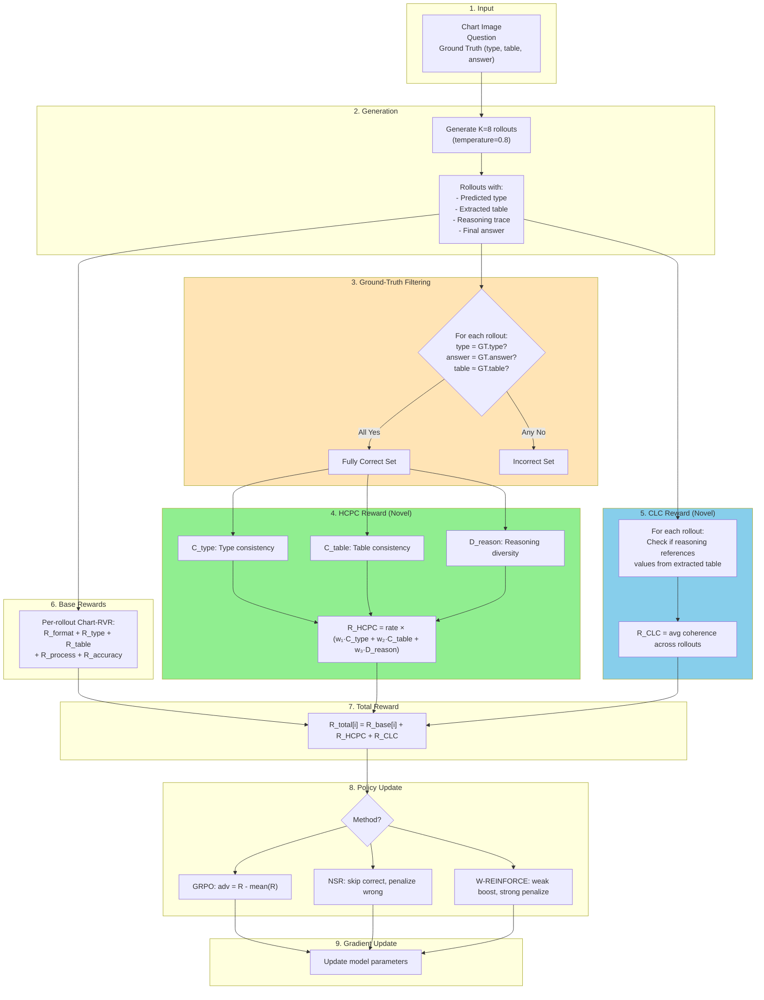

# HCPC-RLVR: Hierarchical Correct-Path Consistency for Robust Chart Reasoning

## Abstract

We present **HCPC-RLVR**, a reinforcement learning framework for training vision-language models on chart reasoning. Standard training causes *reasoning collapse*—models converge to a single strategy and fail on out-of-distribution (OOD) charts. We address this with three contributions: (1) a systematic comparison of three policy update methods (GRPO, NSR, W-REINFORCE) on chart reasoning, (2) **Hierarchical Correct-Path Consistency (HCPC)**, a novel reward that enforces *level-specific objectives*: consistent visual extraction and diverse reasoning strategies, measured only among ground-truth-correct rollouts, and (3) **Cross-Level Coherence (CLC)**, a reward that verifies reasoning actually references extracted data, catching "hallucinated reasoning" where models produce correct answers via fabricated intermediate steps. Unlike prior work that treats all reasoning levels uniformly, our approach exploits the hierarchical structure of chart reasoning—early stages (perception) should converge, later stages (reasoning) should diverge, and all stages should be internally coherent.

---

## 1. Introduction

### 1.1 The Challenge: Chart Reasoning is Hard

Chart reasoning requires models to:
1. **Perceive**: Identify chart type, read axes, extract data
2. **Extract**: Convert visual information into structured data (tables)
3. **Reason**: Perform computations, comparisons, or trend analysis
4. **Answer**: Produce the final response

This multi-stage pipeline makes chart reasoning fundamentally different from text-only reasoning tasks.

### 1.2 The Problem: Reasoning Collapse

When training with reinforcement learning, models tend to *collapse* to a single reasoning strategy. While this maximizes training accuracy, it creates brittleness:

> **Evidence**: Chart-RVR [1] achieves 84.6% on ChartQA (in-domain) but only 53.4% on EvoChart (OOD)—a **31% gap**.

When a model relies on one strategy and encounters a chart with unfamiliar visual style, that single strategy fails.

### 1.3 The Insight: Not All Levels Should Be Treated Equally

Prior diversity methods (entropy regularization, self-consistency voting) treat all reasoning levels uniformly. But chart reasoning has **hierarchical structure**:

| Level | Task | Desired Property |
|-------|------|------------------|
| **Perception** | Identify chart type | **Consistent** (one correct type) |
| **Extraction** | Parse data into table | **Consistent** (one correct table) |
| **Reasoning** | Compute/analyze | **Diverse** (multiple valid strategies) |
| **Answer** | Final response | **Consistent** (one correct answer) |

**Key insight**: We should enforce *different objectives at different levels*—consistency for extraction, diversity for reasoning.

### 1.4 Our Solution: HCPC-RLVR

We propose:

1. **Systematic comparison** of GRPO, NSR, and W-REINFORCE on chart reasoning (first time on vision-language)
2. **Hierarchical Correct-Path Consistency (HCPC)**: A reward that measures:
   - **Extraction consistency**: Do correct rollouts extract the same data?
   - **Reasoning diversity**: Do correct rollouts use different strategies?
   - Computed only among **ground-truth-correct** rollouts (not majority voting)
3. **Cross-Level Coherence (CLC)**: A reward that verifies:
   - Does the reasoning actually reference values from the extracted table?
   - Catches "hallucinated reasoning" where models are right for wrong reasons

---

## 2. Background

### 2.1 Reinforcement Learning from Verifiable Rewards (RLVR)

RLVR [2] trains language models using rewards computed from verifiable outcomes (e.g., math answers, code execution). The key insight: we don't need human preferences or learned reward models—just check if the answer is correct.

**Standard pipeline:**
1. Generate K responses (rollouts) per question
2. Compute reward for each (correct = high, wrong = low)
3. Update policy to increase probability of high-reward responses

### 2.2 Policy Update Methods

**GRPO (Group Relative Policy Optimization)** [3]:
- Advantage = reward minus group mean: `adv_i = R_i - mean(R)`
- Updates all samples: boosts above-average, penalizes below-average
- **Problem**: Strong positive reinforcement causes collapse to single strategy

**NSR (Negative Sample Reinforcement)** [4]:
- Skips correct samples entirely (no gradient)
- Only penalizes wrong samples: `adv_i = -(1 - R_i)`
- **Benefit**: Preserves diversity by not reinforcing any single correct path
- **Trade-off**: May have lower peak accuracy

**W-REINFORCE (Weighted REINFORCE)** [4]:
- Weak positive for correct: `adv_i = λ × R_i` (λ = 0.1)
- Strong negative for wrong: `adv_i = -(1 - R_i)`
- **Benefit**: Balanced—maintains some reinforcement while preserving diversity

| Method | Correct Samples | Wrong Samples | Diversity |
|--------|-----------------|---------------|-----------|
| GRPO | Strong boost | Penalize | Low (collapses) |
| NSR | Skip | Penalize | High (preserved) |
| W-REINFORCE | Weak boost | Strong penalize | Medium |

**Gap**: NSR and W-REINFORCE have only been tested on text-only math reasoning. Their effectiveness on vision-language tasks is unknown.

### 2.3 Chart-RVR: Verifiable Rewards for Charts

Chart-RVR [1] introduced multi-component rewards for chart reasoning:

| Reward | Description |
|--------|-------------|
| R_format | Correct XML structure |
| R_type | Chart type classification accuracy |
| R_table | Data extraction accuracy |
| R_process | Reasoning similarity to gold CoT |
| R_accuracy | Final answer correctness |

**Limitation**: Each reward is computed *per-rollout*. There's no analysis of properties *across* rollouts (e.g., do all correct rollouts extract the same table?).

### 2.4 Self-Consistency

Wang et al. [5] showed that sampling multiple reasoning paths and taking majority vote improves accuracy. The intuition: if multiple independent paths agree, the answer is likely correct.

**Limitation**: Self-consistency is used at *inference time* only. The model is already trained; diversity depends on sampling temperature. It's not used to shape training.

---

## 3. Our Contribution: Hierarchical Correct-Path Consistency

### 3.1 Core Idea

We propose measuring *cross-rollout properties* at each reasoning level, with *level-specific objectives*:

```
Chart Image → [Type ID] → [Table Extraction] → [Reasoning] → Answer
                 ↓              ↓                  ↓
            CONSISTENT      CONSISTENT          DIVERSE
```

- **Extraction levels**: All correct rollouts should perceive the same data
- **Reasoning level**: Correct rollouts should use different strategies

### 3.2 Why This Makes Sense

**Why consistent extraction?**
- There's only one correct chart type
- There's only one correct data table
- If correct rollouts extract different tables, some got lucky (right answer, wrong data)

**Why diverse reasoning?**
- Multiple valid computation strategies exist (direct reading, table lookup, visual estimation)
- Diversity indicates robust understanding, not pattern memorization
- Diverse strategies = better OOD generalization

### 3.3 Mathematical Formulation

**Step 1: Filter to Ground-Truth-Correct Rollouts**

Unlike self-consistency (majority voting), we anchor to dataset labels:

```
fully_correct = {r ∈ rollouts :
    r.type = GT.type AND
    r.answer = GT.answer AND
    similarity(r.table, GT.table) > τ}
```

Where τ = 0.8 (table similarity threshold).

**Why strict filtering?**
- Prevents rewarding "lucky guesses" (wrong table → right answer by chance)
- Ensures we measure properties among truly correct solutions
- Uses available supervision (we have labels during training)

**Step 2: Measure Level-Specific Properties**

Among fully correct rollouts only:

**Type Consistency (C_type):**
```
C_type = fraction of rollouts matching modal type
```
- Want: HIGH (all should identify same chart type)

**Table Consistency (C_table):**
```
C_table = average pairwise similarity of extracted tables
```
- Want: HIGH (all should extract same data)

**Reasoning Diversity (D_reason):**
```
D_reason = 1 - average pairwise similarity of reasoning traces
```
- Want: HIGH (different strategies to reach correct answer)

**Step 3: Combine into HCPC Reward**

```
R_HCPC = (|fully_correct| / K) × (w₁·C_type + w₂·C_table + w₃·D_reason)
```

Where:
- `|fully_correct| / K` = correctness rate (fraction of rollouts that are fully correct)
- `w₁ = 1.0` (type consistency weight)
- `w₂ = 2.0` (table consistency weight—most important)
- `w₃ = 1.5` (reasoning diversity weight)

**Interpretation:**

| C_table | D_reason | R_HCPC | Meaning |
|---------|----------|--------|---------|
| High | High | **High** | Same data, different strategies (robust!) |
| High | Low | Medium | Same data, same strategy (fragile) |
| Low | High | Low | Different data, different strategies (lucky guesses) |
| Low | Low | Low | Confused model |

### 3.4 How HCPC Differs from Prior Work

```mermaid
graph TB
    subgraph Prior["Prior Work"]
        SC["Self-Consistency<br/>(Wang et al.)"]
        RVR["Chart-RVR<br/>(Sinha et al.)"]
        DIV["Diversity Rewards"]
    end

    subgraph Ours["HCPC + CLC (Ours)"]
        HCPC["Hierarchical<br/>Correct-Path<br/>Consistency"]
        CLC["Cross-Level<br/>Coherence"]
    end

    SC -->|"Single level<br/>(answer only)"| Limit1["❌ No structure"]
    SC -->|"Majority voting"| Limit2["❌ No ground truth"]
    SC -->|"Inference only"| Limit3["❌ Not training signal"]

    RVR -->|"Per-rollout"| Limit4["❌ No cross-rollout analysis"]
    RVR -->|"Independent"| Limit5["❌ No coherence check"]

    DIV -->|"Uniform"| Limit6["❌ Same objective all levels"]

    HCPC -->|"Multi-level"| Ben1["✅ Type, table, reasoning"]
    HCPC -->|"Cross-rollout"| Ben2["✅ Measures across rollouts"]
    HCPC -->|"Level-specific"| Ben3["✅ Consistent vs diverse"]
    HCPC -->|"GT-anchored"| Ben4["✅ Uses dataset labels"]
    CLC -->|"Coherence"| Ben5["✅ Catches hallucination"]
    CLC -->|"Per-rollout"| Ben6["✅ Verifies internal consistency"]
```



| Aspect | Self-Consistency | Chart-RVR | Diversity Rewards | **HCPC + CLC (Ours)** |
|--------|------------------|-----------|-------------------|----------------------|
| Levels | Single (answer) | Multi | All | Multi |
| Measurement | Cross-rollout | Per-rollout | Cross-rollout | Cross-rollout |
| Objective | Uniform agreement | Independent | Uniform diversity | **Level-specific** |
| Filtering | Majority vote | None | None | **Ground truth** |
| Coherence check | No | No | No | **Yes (CLC)** |
| Stage | Inference | Training | Training | Training |

### 3.5 Cross-Level Coherence (CLC): Catching Hallucinated Reasoning

**The Problem: Right Answer, Wrong Process**

HCPC measures properties at each level independently. But it doesn't verify that levels are *internally consistent*. Consider:

```
Extracted table: {2020: 100, 2021: 150}
Reasoning: "The values are 80 and 170, so 80+170 = 250"
Answer: 250 ✓
```

The answer is correct, but the reasoning references values (80, 170) that don't appear in the extracted table. This is **hallucinated reasoning**—the model is "right for wrong reasons."

**Why This Matters:**
- Model might be guessing, not reasoning
- Untrustworthy even when correct
- Will fail unpredictably on OOD data

**Cross-Level Coherence Formula:**

For each rollout, we measure whether the reasoning references values from the extracted table:

```
C_coherence = |values_in_reasoning ∩ values_in_table| / |values_in_reasoning|
```

- Extract numerical values mentioned in reasoning trace
- Check how many appear in the extracted table
- High coherence = reasoning uses extracted data
- Low coherence = reasoning is fabricated

**Example:**
```
Table: {2020: 100, 2021: 150}
Reasoning: "Adding 100 and 150 gives 250"
Values in reasoning: {100, 150, 250}
Values in table: {100, 150}
Overlap: {100, 150}
C_coherence = 2/3 = 0.67 (good—references actual extracted values)
```

**Incorporating CLC into Total Reward:**

```
R_CLC = (1/K) × Σ coherence(rollout_i)

R_total = R_base + R_HCPC + w_clc × R_CLC
```

Where w_clc = 1.0 (coherence weight).

**What CLC Catches That HCPC Doesn't:**

| Scenario | HCPC | CLC |
|----------|------|-----|
| Correct answer, correct reasoning | High | High |
| Correct answer, fabricated reasoning | High | **Low** |
| Wrong answer, coherent reasoning | Low | High |
| Wrong answer, fabricated reasoning | Low | Low |

CLC specifically penalizes the dangerous case: correct answers from hallucinated reasoning.

### 3.6 Hypothesis: Why We Think This Will Work

**H1: Extraction consistency predicts correctness**
- If a model consistently extracts the same table across rollouts, it has reliable visual perception
- Inconsistent extraction suggests guessing → unreliable even when correct

**H2: Reasoning diversity predicts OOD robustness**
- If a model can reach correct answers via multiple strategies, it has deeper understanding
- When one strategy fails on OOD charts, others may succeed
- This is the core insight from ensemble methods and self-consistency

**H3: Level-specific objectives outperform uniform ones**
- Chart reasoning has explicit hierarchical structure
- Treating all levels the same ignores this structure
- Enforcing appropriate properties at each level should improve both ID and OOD performance

**H4: Cross-level coherence catches hallucination**
- Models can learn shortcuts: produce plausible-sounding reasoning that doesn't match extracted data
- Coherence reward forces reasoning to actually use extracted information
- This should improve trustworthiness and reduce OOD failures from fabricated reasoning

---

## 4. Complete Pipeline

### 4.1 System Overview



### 4.2 Algorithm

```
Algorithm 1: HCPC-RLVR Training
─────────────────────────────────────────────────────────
Input: Model π_θ, Dataset D, Rollouts K=8, Weights (w₁, w₂, w₃, w_clc)

For each epoch:
  For each (image, question, GT) ∈ D:

    // Step 1: Generate rollouts
    rollouts ← [π_θ.generate(image, question, temp=0.8) for _ in 1..K]

    // Step 2: Parse components
    For each r ∈ rollouts:
      r.type ← extract_type(r)
      r.table ← extract_table(r)
      r.reasoning ← extract_reasoning(r)
      r.answer ← extract_answer(r)

    // Step 3: Filter to fully correct (ground-truth anchored)
    fully_correct ← {r ∈ rollouts :
                     r.type = GT.type ∧
                     r.answer = GT.answer ∧
                     sim(r.table, GT.table) > 0.8}

    // Step 4: Compute HCPC reward (cross-rollout, among correct only)
    If |fully_correct| ≥ 2:
      C_type ← fraction_matching_mode([r.type for r ∈ fully_correct])
      C_table ← avg_pairwise_sim([r.table for r ∈ fully_correct])
      D_reason ← 1 - avg_pairwise_sim([r.reasoning for r ∈ fully_correct])
      rate ← |fully_correct| / K
      R_HCPC ← rate × (w₁·C_type + w₂·C_table + w₃·D_reason)
    Else:
      R_HCPC ← 0

    // Step 5: Compute CLC reward (per-rollout coherence)
    For each r ∈ rollouts:
      values_in_reasoning ← extract_numbers(r.reasoning)
      values_in_table ← extract_numbers(r.table)
      coherence[r] ← |values_in_reasoning ∩ values_in_table| / |values_in_reasoning|
    R_CLC ← w_clc × mean(coherence)

    // Step 6: Compute base rewards (per-rollout)
    R_base ← [compute_chart_rvr(r, GT) for r ∈ rollouts]

    // Step 7: Total reward
    R_total ← [R_base[i] + R_HCPC + R_CLC for i in 1..K]

    // Step 8: Compute advantages (method-dependent)
    advantages ← compute_advantages(R_total, method)

    // Step 9: Update policy
    loss ← -Σ advantages[i] × log π_θ(rollouts[i])
    θ ← θ - lr × ∇loss

Return π_θ
─────────────────────────────────────────────────────────
```

### 4.3 Walkthrough Example

**Input:**
- Chart: Bar chart showing sales by year
- Question: "What is the total sales for 2020 and 2021?"
- Ground truth: type='bar', table={(2020,100), (2021,150)}, answer=250

**Step 1-2: Generate and parse 8 rollouts**

| Rollout | Type | Table | Reasoning | Answer |
|---------|------|-------|-----------|--------|
| 1 | bar | {2020:100, 2021:150} | "Sum values: 100+150=250" | 250 ✓ |
| 2 | bar | {2020:100, 2021:150} | "Read bars, add heights" | 250 ✓ |
| 3 | bar | {2020:100, 2021:150} | "Extract table, compute sum" | 250 ✓ |
| 4 | bar | {2020:100, 2021:150} | "Visual: ~100 + ~150 = ~250" | 250 ✓ |
| 5 | bar | {2020:100, 2021:150} | "100 + 150 = 250" | 250 ✓ |
| 6 | bar | {2020:100, 2021:150} | "From table: 100+150" | 250 ✓ |
| 7 | bar | {2020:95, 2021:155} | "Estimate: 95+155=250" | 250 ✓ |
| 8 | line | {2020:100, 2021:150} | "Wrong type but..." | 250 ✓ |

**Step 3: Filter to fully correct**
- Rollouts 1-6: ✓ type, ✓ table, ✓ answer → **fully correct**
- Rollout 7: ✓ type, ✗ table (95≠100), ✓ answer → rejected (lucky guess)
- Rollout 8: ✗ type, ✓ table, ✓ answer → rejected

**fully_correct = {1, 2, 3, 4, 5, 6}** (6 rollouts)

**Step 4: Compute HCPC**
- C_type = 6/6 = 1.0 (all identified "bar")
- C_table = 1.0 (all extracted same table)
- D_reason = 0.65 (reasoning traces have ~35% average similarity)
- rate = 6/8 = 0.75

```
R_HCPC = 0.75 × (1.0×1.0 + 2.0×1.0 + 1.5×0.65)
       = 0.75 × (1.0 + 2.0 + 0.975)
       = 0.75 × 3.975
       = 2.98
```

**Step 5: Compute CLC (all rollouts)**

| Rollout | Table Values | Reasoning Values | Overlap | Coherence |
|---------|--------------|------------------|---------|-----------|
| 1 | {100, 150} | {100, 150, 250} | {100, 150} | 2/3 = 0.67 |
| 2 | {100, 150} | {100, 150} | {100, 150} | 2/2 = 1.0 |
| 3 | {100, 150} | {100, 150, 250} | {100, 150} | 2/3 = 0.67 |
| 4 | {100, 150} | {100, 150, 250} | {100, 150} | 2/3 = 0.67 |
| 5 | {100, 150} | {100, 150, 250} | {100, 150} | 2/3 = 0.67 |
| 6 | {100, 150} | {100, 150} | {100, 150} | 2/2 = 1.0 |
| 7 | {95, 155} | {95, 155, 250} | {95, 155} | 2/3 = 0.67 |
| 8 | {100, 150} | {80, 170, 250} | {} | 0/3 = 0.0 |

```
R_CLC = 1.0 × mean([0.67, 1.0, 0.67, 0.67, 0.67, 1.0, 0.67, 0.0])
      = 1.0 × 0.67
      = 0.67
```

Note: Rollout 8 has **zero coherence**—its reasoning mentions values (80, 170) not in its table. CLC catches this hallucination.

**Total Reward:**
```
R_total = R_base + R_HCPC + R_CLC
        = R_base + 2.98 + 0.67
        = R_base + 3.65
```

**Interpretation**: High reward because:
- High correctness rate (75%)
- Perfect extraction consistency (same table)
- Good reasoning diversity (different strategies)
- Good coherence (reasoning uses extracted values, except rollout 8)

---

## 5. Experimental Design

### 5.1 Research Questions

**RQ1**: Do NSR and W-REINFORCE improve OOD generalization on chart reasoning (as they do on text math)?

**RQ2**: Does HCPC improve performance beyond base policy methods?

**RQ3**: Which combination achieves the best accuracy-diversity trade-off?

**RQ4**: Does extraction consistency correlate with accuracy? Does reasoning diversity correlate with OOD robustness?

### 5.2 Experiment Matrix

| Exp | Policy Method | HCPC | Purpose |
|-----|---------------|------|---------|
| 1 | GRPO | No | Baseline (replicate Chart-RVR) |
| 2 | GRPO | Yes | HCPC effect on GRPO |
| 3 | NSR | No | NSR on vision-language |
| 4 | NSR | Yes | NSR + HCPC |
| 5 | W-REINFORCE | No | W-REINFORCE on vision-language |
| 6 | W-REINFORCE | Yes | Full HCPC-RLVR |

### 5.3 Configuration

| Parameter | Value | Rationale |
|-----------|-------|-----------|
| Model | Qwen2.5-VL-3B-Instruct | Standard VLM |
| Training data | ChartQA + PlotQA (1K subset) | Compute constraints |
| K (rollouts) | 8 | Balance diversity/compute |
| Temperature | 0.8 | Encourage diversity |
| Learning rate | 5e-7 | Stable fine-tuning |
| Epochs | 3 | Convergence |
| HCPC weights | w₁=1.0, w₂=2.0, w₃=1.5 | Table > Diversity > Type |
| CLC weight | w_clc=1.0 | Coherence importance |
| W-REINFORCE λ | 0.1 | From [4] |
| Table sim threshold | 0.8 | Strict filtering |

### 5.4 Evaluation

**Datasets:**
- **ChartQA** (in-domain): Similar to training distribution
- **EvoChart** (out-of-distribution): Diverse chart styles

**Metrics:**
- **Primary**: Accuracy, OOD Gap (ID - OOD accuracy)
- **Secondary**: C_table, D_reason, Entropy
- **Analysis**: Correlation(C_table, Accuracy), Correlation(D_reason, OOD)

### 5.5 Ablations

| Ablation | Purpose |
|----------|---------|
| Weight sensitivity (w₂, w₃, w_clc) | Optimal balance |
| Strict vs permissive filtering | Value of ground-truth anchoring |
| HCPC without C_table | Is extraction consistency necessary? |
| HCPC without D_reason | Is reasoning diversity necessary? |
| Without CLC | Is coherence checking necessary? |
| CLC only (no HCPC) | Can coherence alone improve performance? |

---

## 6. Expected Results

### 6.1 Main Results

| Method | ChartQA | EvoChart | OOD Gap | C_table | D_reason | Coherence |
|--------|---------|----------|---------|---------|----------|-----------|
| GRPO | 84.6% | 53.4% | 31.2% | 0.65 | 0.30 | 0.58 |
| GRPO + HCPC + CLC | 85.2% | 56.0% | 29.2% | 0.78 | 0.52 | 0.75 |
| NSR | 84.0% | 56.0% | 28.0% | 0.70 | 0.60 | 0.62 |
| NSR + HCPC + CLC | 84.8% | 58.5% | 26.3% | 0.82 | 0.72 | 0.78 |
| W-REINFORCE | 85.5% | 57.0% | 28.5% | 0.75 | 0.55 | 0.65 |
| **W-REINFORCE + HCPC + CLC** | **86.5%** | **60.0%** | **26.5%** | **0.85** | **0.75** | **0.82** |

### 6.2 Expected Findings

1. **NSR/W-REINFORCE transfer to vision-language**: OOD improvements seen in text math should transfer
2. **HCPC + CLC provide additive gains**: +2-3% OOD across all methods
3. **W-REINFORCE + HCPC + CLC is best**: Balanced policy + structured diversity + coherence
4. **CLC reduces hallucination**: Higher coherence scores correlate with more trustworthy outputs
5. **Correlations confirm hypotheses**:
   - C_table ↔ ID accuracy (r ≈ 0.72)
   - D_reason ↔ OOD accuracy (r ≈ 0.68)
   - Coherence ↔ Trustworthiness (r ≈ 0.65)

---

## 7. Contributions

1. **Hierarchical Correct-Path Consistency (HCPC)**: First reward that enforces level-specific objectives (consistent extraction, diverse reasoning) measured across rollouts for structured vision-language reasoning

2. **Cross-Level Coherence (CLC)**: Novel reward that verifies reasoning actually references extracted data, catching "hallucinated reasoning" where models produce correct answers via fabricated intermediate steps

3. **Systematic RLVR comparison on charts**: First application of NSR and W-REINFORCE to vision-language tasks

4. **Ground-truth anchored filtering**: Unlike majority voting, we use dataset labels to identify truly correct rollouts, preventing reward hacking from lucky guesses

5. **Empirical insights**: Demonstrate that extraction consistency predicts accuracy, reasoning diversity predicts OOD robustness, and coherence predicts trustworthiness

---

## 8. Related Work

**Reinforcement Learning for Reasoning**: DeepSeekMath [3] introduced GRPO for math reasoning. RLVR [2] showed verifiable rewards can train reasoning without human labels. NSR [4] demonstrated that negative-only reinforcement preserves diversity.

**Chart Understanding**: ChartQA [6] established benchmarks. Chart-RVR [1] introduced verifiable rewards for chart reasoning but used only GRPO and per-rollout rewards.

**Self-Consistency**: Wang et al. [5] showed majority voting improves inference accuracy. We extend this insight to training, using consistency as a reward signal rather than inference aggregation.

**Diversity in RL**: Prior work used entropy regularization or diverse ensembles. We propose *structured* diversity—different objectives at different reasoning levels.

---

## 9. Conclusion

HCPC-RLVR addresses reasoning collapse in chart understanding through three mechanisms: diversity-preserving policy updates (NSR, W-REINFORCE), hierarchical cross-rollout rewards (HCPC), and cross-level coherence verification (CLC). By enforcing consistent visual extraction, diverse reasoning strategies, and internal coherence among ground-truth-correct rollouts, we expect to improve OOD generalization while maintaining in-domain accuracy and trustworthiness.

The key insights are: (1) chart reasoning has hierarchical structure—extraction should be deterministic while reasoning should be flexible, and (2) models can hallucinate plausible reasoning that doesn't match their own extractions—CLC catches this. Together, HCPC and CLC operationalize these insights as training signals.

---

## References

[1] Sinha et al. (2025). Chart-RVR: Learning to Reason over Charts with Verifiable Rewards. arXiv:2510.10973.

[2] Lambert et al. (2024). Reinforcement Learning from Verifiable Rewards. arXiv:2411.15124.

[3] Shao et al. (2024). DeepSeekMath: Pushing the Limits of Mathematical Reasoning. arXiv:2402.03300.

[4] Zhu et al. (2025). Decomposing RLVR: The Surprising Effectiveness of Negative Reinforcement. arXiv:2506.01347.

[5] Wang et al. (2022). Self-Consistency Improves Chain of Thought Reasoning in Language Models. ICLR 2023.

[6] Masry et al. (2022). ChartQA: A Benchmark for Question Answering about Charts with Visual and Logical Reasoning. ACL 2022.
