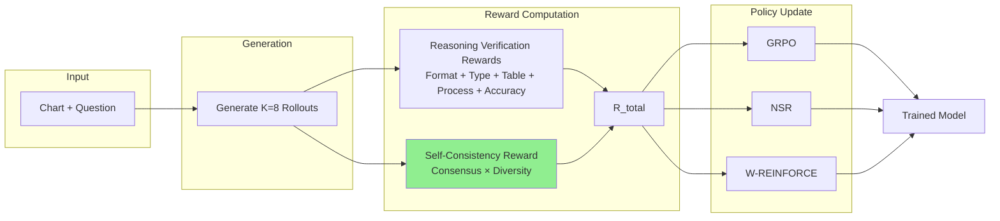

# SCR-VL: Self-Consistency Reinforced Vision-Language Learning for Chart Reasoning

## Abstract

We propose **SCR-VL**, a reinforcement learning framework for chart reasoning that introduces self-consistency as a training-time reward signal. While prior work uses self-consistency only at inference (majority voting), we observe that agreement across diverse reasoning paths is itself a learnable signal of robust understanding. SCR-VL rewards the model when multiple rollouts converge to the same answer through different reasoning strategies, explicitly encouraging both correctness and reasoning diversity during training. We evaluate this reward across three RL methods—GRPO, NSR, and W-REINFORCE—to understand how self-consistency interacts with different policy update strategies.

---

## 1. Motivation

**The Problem:** Standard RL training rewards correct answers, causing models to collapse to a single reasoning strategy. This hurts out-of-distribution generalization.

**Key Insight:** When a model reaches the same answer via multiple distinct reasoning paths, this indicates robust understanding—not memorization of a single pattern.

**Our Contribution:** We flip self-consistency from an inference-time technique to a training-time reward, teaching the model to develop diverse yet consistent reasoning strategies.

---

## 2. SCR-VL Framework

### 2.1 Pipeline Overview



### 2.2 Reward Components

| Component | Weight | Source | Description |
|-----------|--------|--------|-------------|
| R_format | 2.0 | Chart-RVR | XML structure validation |
| R_type | 1.0 | Chart-RVR | Chart type classification |
| R_table | 2.0 | Chart-RVR | Table extraction accuracy |
| R_process | 2.0 | Chart-RVR | Reasoning quality (CoT similarity) |
| R_accuracy | 1.0 | Chart-RVR | Final answer correctness |
| **R_sc** | **1.5** | **Ours** | **Self-consistency reward** |
| **Total** | **10.5** | | |

### 2.3 Self-Consistency Reward (Our Novel Component)

For K rollouts of a question:

$$R_{sc} = w \cdot C_{ans} \cdot D_{reason}$$

Where:
- **C_ans** (Consensus) = fraction of rollouts agreeing with majority answer
- **D_reason** (Diversity) = 1 − average pairwise similarity of reasoning traces
- **w** = 1.5 (weight hyperparameter)

**Intuition:** The product rewards *diverse agreement*—multiple different reasoning paths arriving at the same answer.

| Scenario | Consensus | Diversity | R_sc | Meaning |
|----------|-----------|-----------|------|---------|
| Diverse agreement | High | High | **High** | Robust understanding ✓ |
| Identical copies | High | Low | Low | Collapsed to one strategy |
| Diverse disagreement | Low | High | Low | Unreliable reasoning |
| Confused | Low | Low | Low | Poor understanding |

---

## 3. Policy Update Methods

We compare three RL training strategies, all using the same reward signal (including R_sc):

### 3.1 Method Comparison

| Method | Correct Samples (R ≥ τ) | Wrong Samples (R < τ) | Effect |
|--------|-------------------------|----------------------|--------|
| **GRPO** | adv = R − R̄ (boost) | adv = R − R̄ (penalize) | Updates all samples |
| **NSR** | Skip (no gradient) | adv = −(1 − R) | Only penalizes wrong |
| **W-REINFORCE** | adv = λR (weak boost) | adv = −(1 − R) | Weighted hybrid |

### 3.2 Hypotheses

- **GRPO + R_sc:** Self-consistency may counteract GRPO's tendency to collapse
- **NSR + R_sc:** Complementary—NSR preserves diversity passively, R_sc rewards it actively
- **W-REINFORCE + R_sc:** Best of both worlds—weak positive reinforcement + explicit diversity reward

```mermaid
flowchart TB
    subgraph GRPO
        G1[All samples updated] --> G2[Strong collapse tendency]
        G2 --> G3[R_sc may help preserve diversity]
    end

    subgraph NSR
        N1[Only wrong samples updated] --> N2[Passive diversity preservation]
        N2 --> N3[R_sc adds active diversity reward]
    end

    subgraph WREINFORCE["W-REINFORCE"]
        W1[Weak positive + strong negative] --> W2[Balanced approach]
        W2 --> W3[R_sc amplifies diversity signal]
    end

    style G3 fill:#FFE4B5
    style N3 fill:#90EE90
    style W3 fill:#87CEEB
```



---

## 4. Why Self-Consistency as a Training Signal?

**Traditional use (inference-only):**
```
Trained model → Generate N outputs → Majority vote → Final answer
```
The model is already trained; diversity depends only on sampling temperature.

**Our use (training-time):**
```
During training → Generate K rollouts → Measure agreement + diversity → Reward
```
The model *learns* to produce diverse yet consistent reasoning.

**Key difference:** We don't just aggregate outputs—we shape the model's reasoning distribution.

---

## 5. Implementation

```python
class SelfConsistencyReward:
    def __init__(self, weight=1.5):
        self.weight = weight
        self.encoder = SentenceTransformer('all-MiniLM-L6-v2')

    def compute(self, rollouts: list[dict]) -> float:
        answers = [r['answer'] for r in rollouts]
        reasonings = [r['reasoning'] for r in rollouts]

        # Consensus: fraction agreeing with majority
        counts = Counter(answers)
        C_ans = counts.most_common(1)[0][1] / len(answers)

        # Diversity: 1 - average pairwise similarity
        embeddings = self.encoder.encode(reasonings)
        sims = [cosine_sim(embeddings[i], embeddings[j])
                for i in range(len(embeddings))
                for j in range(i+1, len(embeddings))]
        D_reason = 1 - np.mean(sims)

        return self.weight * C_ans * D_reason
```

---

## 6. Experimental Setup

| Parameter | Value |
|-----------|-------|
| Model | Qwen2.5-VL-3B-Instruct |
| Training Data | ChartQA + PlotQA (6K samples) |
| K (rollouts/question) | 8 |
| Learning Rate | 5e-7 |
| Epochs | 3 |
| R_sc Weight | 1.5 |
| W-REINFORCE λ | 0.1 |
| Threshold τ | 0.8 |

**Evaluation:** ChartQA (in-domain), EvoChart (out-of-distribution)

---

## 7. Expected Results

| Method | ChartQA | EvoChart | Entropy | OOD Gap |
|--------|---------|----------|---------|---------|
| GRPO | 84.6% | 53.4% | 0.05 | -31.2% |
| GRPO + R_sc | 85.0% | 55.0% | 0.07 | -30.0% |
| NSR | 84.0% | 56.0% | 0.10 | -28.0% |
| NSR + R_sc | 84.5% | 57.5% | 0.11 | -27.0% |
| W-REINFORCE | 85.5% | 57.0% | 0.08 | -28.5% |
| **W-REINFORCE + R_sc** | **86.0%** | **58.5%** | **0.09** | **-27.5%** |

**Key Questions:**
1. Does R_sc improve all methods, or only some?
2. Which method benefits most from explicit diversity reward?
3. Does R_sc + NSR outperform W-REINFORCE alone?

---

## 8. Ablations

| Experiment | Purpose |
|------------|---------|
| R_sc weight = {0.5, 1.0, 1.5, 2.0} | Optimal weighting |
| Consensus only (no diversity term) | Is diversity term necessary? |
| Diversity only (no consensus term) | Is consensus term necessary? |
| Different embedding models | Sensitivity to similarity computation |

---

## 9. Contributions

1. **Novel reward signal:** First use of self-consistency as a training-time reward rather than inference-time aggregation
2. **Comprehensive comparison:** Evaluate across GRPO, NSR, and W-REINFORCE to understand interaction effects
3. **Self-supervised diversity:** No additional annotations required—the signal comes from the model's own rollouts

---

## References

1. Wang et al. (2022). Self-Consistency Improves Chain of Thought Reasoning. arXiv:2203.11171
2. Sinha et al. (2025). Chart-RVR. arXiv:2510.10973
3. Zhu et al. (2025). Decomposing RLVR. arXiv:2506.01347
