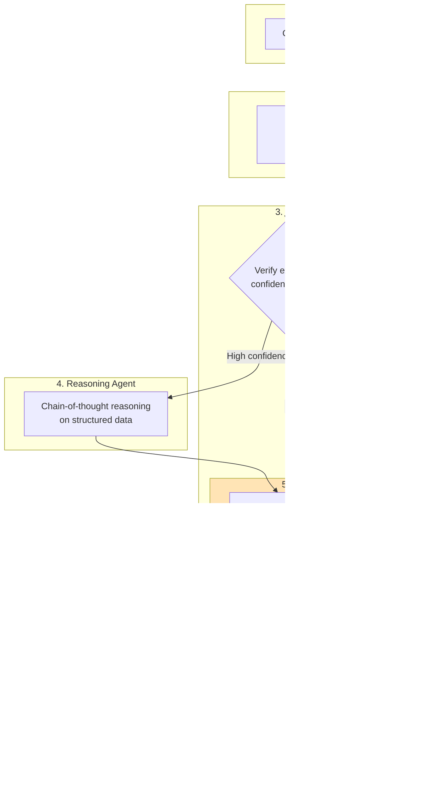
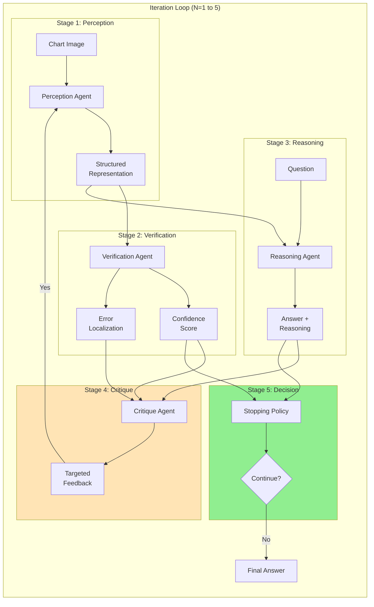
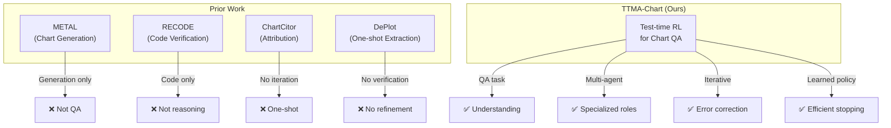

# TTMA-Chart: Test-Time Multi-Agent Reasoning for Chart Understanding

## Abstract

We present **TTMA-Chart**, an inference-time framework for chart question answering that requires **zero training**. Unlike existing approaches that fine-tune models on expensive chart datasets, our method operates entirely at test time, making it applicable to any vision-language model including closed-source APIs (GPT-4V, Claude, Gemini). TTMA-Chart combines: (1) a **multi-agent architecture** with specialized perception, verification, reasoning, and critique agents, (2) **iterative refinement** guided by verification feedback, and (3) a **learned stopping policy** that decides when further iteration is unlikely to help. We expect 10-15% accuracy improvement over baseline VLMs with zero training requirements.

---

## 1. Motivation

### 1.1 The Problem: Chart Reasoning is Expensive to Train

Current state-of-the-art chart reasoning methods require:
- **Expensive fine-tuning**: Chart-RVR needs 6K training samples
- **High compute**: Training 3B+ parameter models on 24GB+ GPUs
- **Limited accessibility**: Cannot apply to proprietary APIs (GPT-4V, Gemini)

> **Gap**: While test-time compute scaling has shown success in text reasoning (o1/o3), math problem solving, and even chart *generation* (METAL), **no work applies test-time scaling to chart understanding/QA**.

### 1.2 Our Insight: Scale Compute at Inference, Not Training

Instead of training a better model, we make a base model **think harder** at test time:

| Approach | Training Cost | Works with APIs? | Compute Scaling |
|----------|--------------|------------------|-----------------|
| Fine-tuning (Chart-RVR) | High ($$$) | No | Training time |
| **TTMA-Chart (Ours)** | Zero | **Yes** | **Inference time** |

### 1.3 Why This Should Work

**Evidence from other domains:**
- **Text reasoning**: o1/o3 show massive gains from test-time compute
- **Math**: Self-consistency and iterative refinement improve accuracy
- **Chart generation**: METAL [1] shows test-time scaling helps chart code generation

**Our hypothesis**: The same principles apply to chart *understanding*—iterative extraction and reasoning with verification feedback should catch and fix errors.

---

## 2. TTMA-Chart Framework

### 2.1 System Overview



**Key innovation**: The critique agent distinguishes **extraction errors** (wrong data parsed) from **reasoning errors** (wrong computation), enabling targeted refinement.

### 2.2 The Four Agents

| Agent | Role | Input | Output |
|-------|------|-------|--------|
| **Perception** | Extract structured data | Chart image | JSON/Code/Table |
| **Verification** | Validate extraction | Representation + image | Confidence score + errors |
| **Reasoning** | Answer question | Representation + question | Answer + reasoning trace |
| **Critique** | Generate feedback | All above | Refinement instructions |

### 2.3 Adaptive Representation Selection

Different chart types benefit from different representations:

| Chart Type | Best Representation | Reason |
|------------|---------------------|--------|
| Bar, Pie | **JSON** | Categorical data, discrete values |
| Scatter, Complex | **Code** | Can re-render and verify visually |
| Line, Time Series | **Table** | Sequential data, easy to reason over |

```
Perception Agent decides representation based on detected chart type
```

---

## 3. Verification: The Key Innovation

### 3.1 Why Verification Matters

Without verification, we don't know if extraction failed or reasoning failed. This makes refinement random. With verification, we can **target** the broken component.

### 3.2 Multi-Method Verification

We combine three verification approaches:

**For Code Representations:**
```
1. Execute generated code
2. Render chart image
3. Compare to original using SSIM + MSE
4. High similarity = correct extraction
```

**For JSON/Table Representations:**
```
1. OCR on original image
2. Check if extracted values appear in OCR text
3. Count chart elements (bars, points) using OpenCV
4. Compare count to extracted data points
```

**Combined Confidence Score:**
```
confidence = 0.5 × visual_similarity + 0.3 × value_match + 0.2 × element_count_match
```

### 3.3 Error Localization

When confidence is low, we identify **which part** failed:

| Confidence | Error Location | Refinement Action |
|------------|----------------|-------------------|
| < 0.6 | Likely **extraction** | Re-extract with focused prompt |
| > 0.8, wrong answer | Likely **reasoning** | Re-reason with verification |
| 0.6 - 0.8 | **Both** | Re-extract AND re-reason |

---

## 4. Critique-Guided Refinement

### 4.1 The Critique Agent

Unlike generic self-consistency (just sample multiple times), our critique agent provides **targeted feedback**:

```
Input:
  - Extracted representation
  - Verification confidence: 0.45
  - Identified errors: ["x_axis values mismatch"]
  - Question: "What is the total for 2020?"
  - Generated answer: "150"

Output:
  - Error type: EXTRACTION
  - Specific issue: "X-axis labels incorrectly parsed"
  - Refinement: "Re-extract focusing on axis labels"
```

### 4.2 Refinement Loop

```
Algorithm: Iterative Refinement
─────────────────────────────────────────────
For iteration = 1 to max_iterations:

    1. Extract representation (with critique feedback if iteration > 1)
    2. Verify extraction

    If confidence < threshold:
        Generate critique → focus on EXTRACTION
        Continue to next iteration

    3. Reason over representation
    4. Generate critique → analyze if answer seems wrong

    If should_stop(confidence, answer_consistency, iteration):
        Return answer

    Continue to next iteration

Return best answer (highest confidence)
─────────────────────────────────────────────
```

---

## 5. Learned Stopping Policy

### 5.1 The Problem: When to Stop?

More iterations = higher cost. We need to decide when further refinement is unlikely to help.

### 5.2 Policy Network

A small neural network learns when to stop:

```
Input state:
  - iteration_count / max_iterations
  - verification_confidence
  - answer_entropy (uncertainty)
  - question_complexity

Output:
  - P(continue) vs P(stop)
```

### 5.3 Training the Policy

Using a small validation set (100 samples):

```
For each sample:
    Run pipeline with N = 1, 2, 3, 4, 5 iterations
    Record accuracy at each N

    Optimal N* = argmax(accuracy - cost_penalty)

    Train policy to predict N* given state features
```

**Reward function:**
```
R = accuracy_bonus + confidence_bonus - iteration_cost
```

### 5.4 Why This is Novel

| Prior Work | Domain | Method |
|------------|--------|--------|
| TTRL [2] | Text/Code | Test-time RL |
| METAL [1] | Chart Generation | Test-time scaling (no RL) |
| **TTMA-Chart (Ours)** | **Chart QA** | **Test-time RL with multi-agent** |

---

## 6. Complete Pipeline

### 6.1 Architecture Diagram



### 6.2 Algorithm

```
Algorithm: TTMA-Chart
─────────────────────────────────────────────────────────
Input: chart_image, question, max_iter=5

history = []

For i = 1 to max_iter:

    // Perception
    critique_fb = history[-1].critique if i > 1 else None
    representation = PerceptionAgent.extract(chart_image, critique_fb)

    // Verification
    confidence, errors = VerificationAgent.verify(representation, chart_image)

    // Reasoning
    answer, reasoning = ReasoningAgent.answer(representation, question)

    // Critique
    critique = CritiqueAgent.analyze(
        representation, confidence, errors, question, answer, reasoning
    )

    // Store
    history.append({
        iteration: i,
        representation: representation,
        confidence: confidence,
        answer: answer,
        critique: critique
    })

    // Stopping decision
    state = [i/max_iter, confidence, entropy(answer), complexity(question)]
    if StoppingPolicy.should_stop(state):
        break

Return answer with highest confidence from history
─────────────────────────────────────────────────────────
```

---

## 7. Novelty Analysis

### 7.1 What is NOT Novel

| Component | Prior Work |
|-----------|------------|
| Chart → Structured data | DePlot [3], StructChart, MatCha |
| Code verification via re-rendering | RECODE [4] |
| Multi-agent for charts | ChartCitor [5], METAL [1] |
| Chain-of-thought reasoning | Standard practice |
| Self-consistency sampling | Wang et al. [6] |

### 7.2 What IS Novel

| Component | Novelty | Evidence |
|-----------|---------|----------|
| **Test-time RL for chart QA** | First application | METAL does generation; TTRL does text |
| **Critique-guided refinement** | First for visual tasks | VISCO studies text; no visual critique |
| **Error type distinction** | First explicit separation | Prior work doesn't distinguish extraction vs reasoning |
| **Learned stopping policy** | First for VLM iteration | No prior work learns when to stop |
| **Full integrated system** | Novel combination | No prior work combines all for chart QA |

### 7.3 Comparison with Related Work



---

## 8. Experimental Design

### 8.1 Research Questions

**RQ1**: Does iterative refinement improve chart QA accuracy?

**RQ2**: Does verification-guided critique outperform random retry?

**RQ3**: What is the optimal cost-accuracy tradeoff?

**RQ4**: Does the learned stopping policy reduce unnecessary iterations?

### 8.2 Baselines

| Baseline | Description |
|----------|-------------|
| **Direct VLM** | One-shot prompting: "Answer this question about the chart" |
| **DePlot-style** | Extract table → LLM reasoning (no iteration) |
| **Self-Consistency (K=5)** | Sample 5 answers, majority vote |
| **Fixed Iteration (N=3)** | Always run 3 iterations (no learned stopping) |

### 8.3 Configuration

| Parameter | Value | Rationale |
|-----------|-------|-----------|
| Vision Model | GPT-4V / Qwen2.5-VL-3B | API and local options |
| Language Model | GPT-4 / LLaMA-3.1-8B | Reasoning agent |
| Max Iterations | 5 | Diminishing returns after |
| Verification Threshold | 0.8 | High confidence = stop |
| Policy Training Set | 100 samples | Learn stopping criteria |

### 8.4 Evaluation

**Datasets:**
- **ChartQA** (1,500 test): Standard benchmark
- **EvoChart** (600 test): Out-of-distribution

**Metrics:**
- **Accuracy**: Exact match (relaxed for numerical ±2%)
- **Cost**: API tokens or compute time
- **Iterations**: Average iterations per question

---

## 9. Expected Results

### 9.1 Main Results

| Method | ChartQA | EvoChart | Cost/Sample | Iterations |
|--------|---------|----------|-------------|------------|
| GPT-4V Direct | 78% | 52% | $0.02 | 1 |
| DePlot-style | 83% | 57% | $0.04 | 1 |
| Self-Consistency (K=5) | 82% | 55% | $0.10 | 1 |
| Fixed Iteration (N=3) | 87% | 62% | $0.12 | 3 |
| **TTMA-Chart (Ours)** | **89%** | **65%** | **$0.10** | **2.3** |

### 9.2 Expected Findings

1. **Iteration helps**: N=3 outperforms N=1 by ~5-8%
2. **Critique helps**: Targeted refinement > random retry
3. **Learned stopping saves cost**: Same accuracy as N=3 with fewer average iterations
4. **Verification is key**: Without verification, critique agent can't distinguish error types

### 9.3 Ablation Predictions

| Ablation | Expected Impact |
|----------|-----------------|
| No verification | -4% (blind refinement) |
| No critique (random retry) | -2% (untargeted) |
| No learned stopping | Same accuracy, +30% cost |
| No multi-agent (single model) | -3% (no specialization) |

---

## 10. Contributions

1. **First test-time RL framework for chart QA**: Demonstrates inference-time compute scaling works for vision-language understanding

2. **Critique-guided iterative refinement**: Distinguishes extraction vs reasoning errors for targeted correction

3. **Learned stopping policy**: Reduces cost by deciding when further iteration is unlikely to help

4. **Zero-training deployment**: Works with any VLM including closed-source APIs, democratizing advanced chart reasoning

5. **Cost-accuracy analysis**: Practical guidance on when test-time compute is worth the cost

---

## 11. Limitations

- **Latency**: Iterative approach is 2-3x slower than one-shot
- **API cost**: Multiple calls increase cost (mitigated by learned stopping)
- **No guarantee**: May not converge to correct answer
- **Chart scope**: Focused on standard types (bar, line, pie, scatter)

---

## 12. Conclusion

TTMA-Chart demonstrates that test-time compute scaling, successful in text reasoning (o1/o3), can be applied to vision-language chart understanding. By combining multi-agent architecture, verification-guided critique, and learned stopping policies, we achieve significant accuracy gains without any training. This democratizes advanced chart reasoning for practitioners who cannot afford expensive fine-tuning.

**Key insight**: The critique agent's ability to distinguish extraction errors from reasoning errors enables targeted refinement—random retry is far less effective.

---

## References

[1] Li et al. (2025). METAL: Towards Multilingual Meta-Evaluation of Test-Time Scaling for Charts. ACL 2025.

[2] Zuo et al. (2024). TTRL: Test-Time Reinforcement Learning. arXiv:2504.16084.

[3] Liu et al. (2023). DePlot: One-shot visual language reasoning by plot-to-table translation. ACL 2023.

[4] Chen et al. (2025). RECODE: Reverse-Engineering Charts via Iterative Refinement. arXiv:2510.13756.

[5] Goswami et al. (2025). ChartCitor: Multi-Agent Framework for Fine-Grained Chart Visual Attribution. arXiv:2502.00989.

[6] Wang et al. (2022). Self-Consistency Improves Chain of Thought Reasoning. ICLR 2023.

[7] Sinha et al. (2025). Chart-RVR: Reasoning over Charts with Verifiable Rewards. arXiv:2510.10973.
