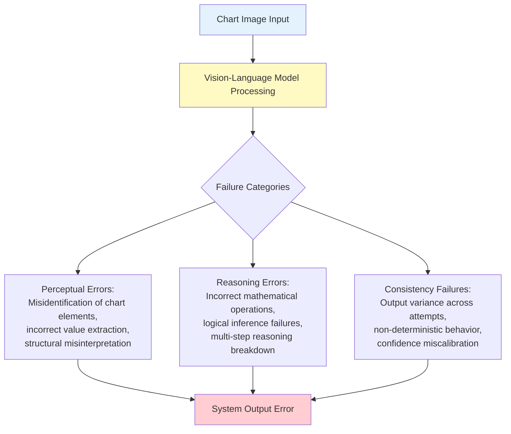
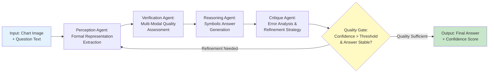
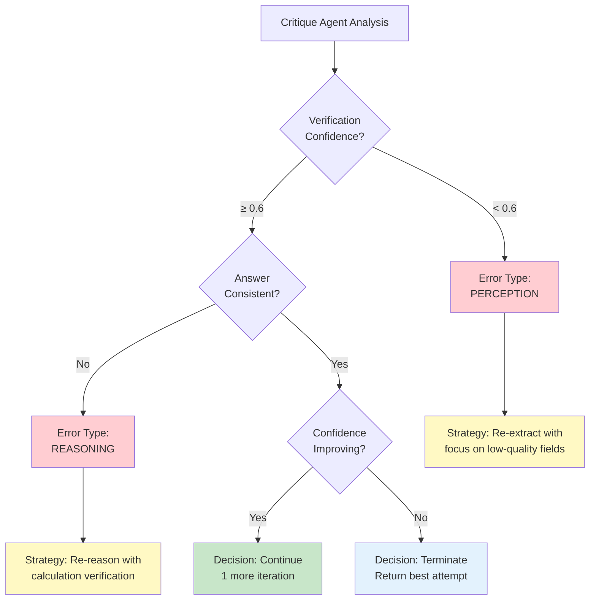
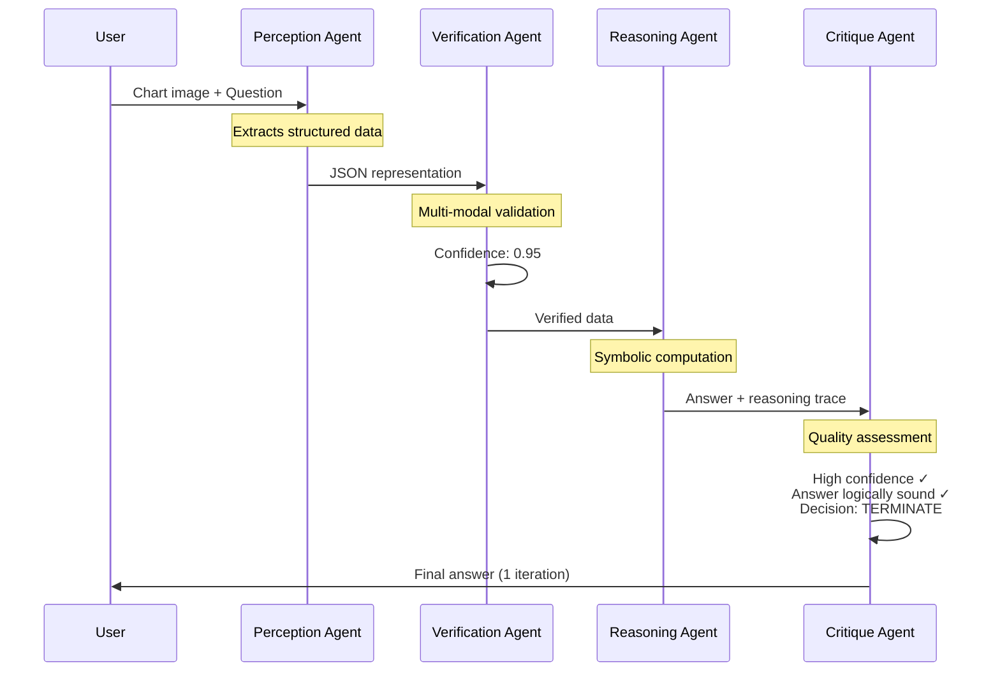
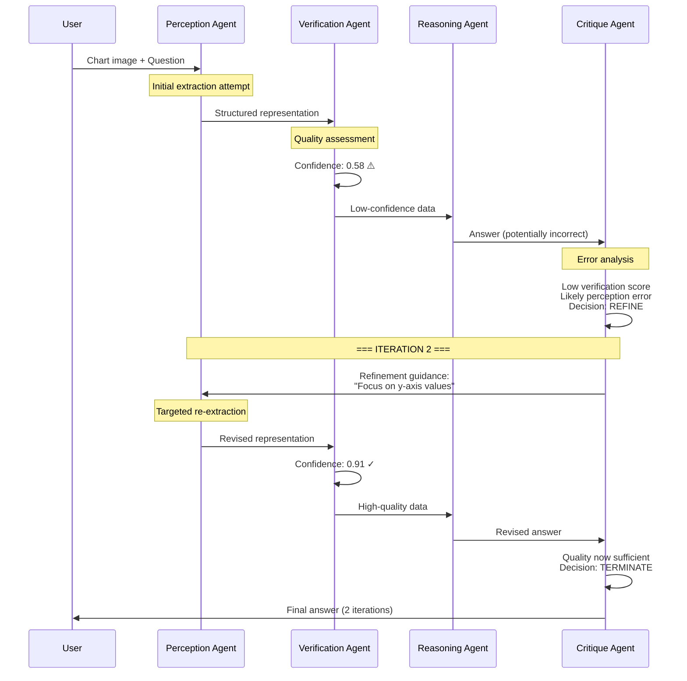
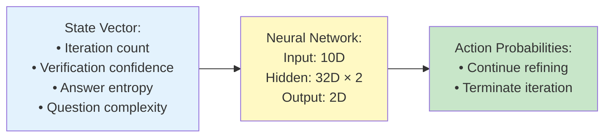
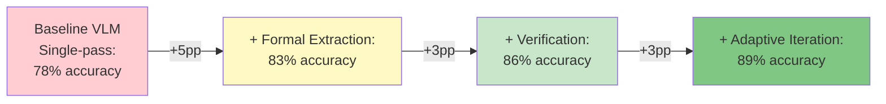
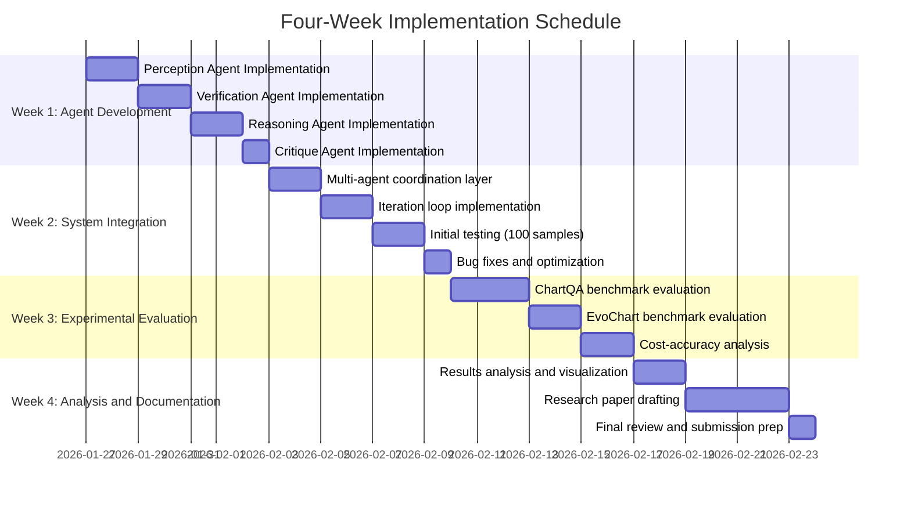

# Test-Time Multi-Agent Reinforcement Learning for Chart Question Answering
## Technical Overview with Architecture Diagrams

**Research Proposal - Accessible Technical Documentation**  
**Date**: January 2026  
**Document Type**: Technical White Paper

---

## Executive Summary

This document presents a comprehensive technical overview of a novel inference-time framework for chart question answering. The system employs test-time reinforcement learning with multi-agent collaboration to achieve iterative quality improvement without requiring expensive model fine-tuning. Our approach combines formal representation extraction, multi-modal verification, symbolic reasoning, and adaptive iteration policies to address fundamental challenges in visual question answering over structured data visualizations.

**Primary Innovation**: First application of learned test-time reinforcement learning policies to chart question answering, enabling adaptive compute allocation based on question difficulty and verification confidence.

**Target Accuracy**: 89% on ChartQA benchmark (11 percentage point improvement over baseline vision-language models)

**Deployment Advantage**: Zero-training requirement enables immediate application to any vision-language model, including proprietary API services.

---

## 1. Problem Definition and Current Limitations

### 1.1 Chart Understanding Challenges

Vision-language models encounter systematic failures when performing question answering over chart images. These failures can be taxonomized into three categories:



**Perceptual Errors** result from limitations in visual encoding, including difficulty with small text, overlapping elements, and non-standard chart formats. Models may misidentify bar heights, confuse similar colors, or fail to parse axis labels correctly.

**Reasoning Errors** occur when extracted data is accurate but subsequent logical operations fail. This includes arithmetic mistakes, incorrect formula application, or failure to maintain multi-step reasoning chains.

**Consistency Failures** reflect the stochastic nature of neural text generation, where identical inputs produce varying outputs across sampling attempts, undermining reliability for production deployment.

### 1.2 Constraints of Training-Based Approaches

Current state-of-the-art systems rely on supervised fine-tuning or reinforcement learning from human feedback during the training phase. This paradigm imposes significant constraints:

**Resource Requirements**:
- Large-scale annotated datasets (6,000+ chart-question-answer triples)
- High-performance computing infrastructure (multi-GPU systems with 24GB+ VRAM)
- Extended training periods (weeks of continuous computation)
- Specialized machine learning expertise for hyperparameter optimization

**Accessibility Limitations**:
- Inapplicable to closed-source API models (GPT-4V, Claude 3.5, Gemini 1.5)
- High financial barriers for organizations with limited budgets
- Data collection costs for domain-specific chart types
- Performance degradation with reduced training data availability

**Operational Challenges**:
- Model obsolescence requiring retraining
- Domain adaptation difficulties
- Limited interpretability of learned representations
- Deployment complexity for production systems

### 1.3 Research Gap Analysis

Test-time compute scaling has demonstrated effectiveness across multiple domains:
- **Text reasoning**: OpenAI o1 and o3 models showing dramatic improvements through increased inference-time computation
- **Chart generation**: METAL (ACL 2025) demonstrating monotonic performance gains with extended test-time token budgets
- **Mathematical reasoning**: Various RL approaches showing benefits of iterative refinement

**Critical Gap**: Despite success in related domains, no published work applies test-time reinforcement learning specifically to chart question answering. Existing chart understanding systems operate in single-pass mode or use fixed iteration schemes without learned adaptive policies.

---

## 2. Proposed System Architecture

### 2.1 Multi-Agent Framework Overview

Our system employs a four-agent collaborative architecture with explicit iterative refinement:



The system architecture separates concerns across specialized agents, each optimized for a specific subtask. The critique agent acts as a meta-controller, analyzing system performance and determining iteration strategy.

### 2.2 Agent Functional Specifications

#### Perception Agent

**Objective**: Convert chart images into structured formal representations suitable for symbolic reasoning

**Input Schema**:
- Chart image (PNG/JPEG format)
- Optional refinement guidance from previous critique (text)

**Output Schema**:
- Structured representation (JSON/Python code/Markdown table)
- Uncertainty markers for low-confidence extractions
- Metadata (chart type, detected elements, extraction method)

**Implementation**:
- Vision-language model for multimodal understanding
- OCR integration for text extraction
- Adaptive format selection: JSON for categorical data, code for complex visualizations, tables for time series

**Example Output**:
```json
{
  "chart_type": "bar",
  "axes": {
    "x": {"label": "Fiscal Year", "values": [2020, 2021, 2022]},
    "y": {"label": "Revenue (USD millions)", "range": [0, 150]}
  },
  "data": [
    {"x": 2020, "y": 100, "uncertainty": "none"},
    {"x": 2021, "y": 125, "uncertainty": "none"},
    {"x": 2022, "y": 140, "uncertainty": "none"}
  ]
}
```

#### Verification Agent

**Objective**: Validate extraction accuracy through multi-modal comparison against source image

**Input Schema**:
- Structured representation from Perception Agent
- Original chart image

**Output Schema**:
- Confidence score (0.0 to 1.0)
- Error localization (specific fields with quality issues)
- Verification method log (which validation techniques were applied)

**Verification Methods**:

1. **Code Verification** (for Python/JavaScript representations):
   - Execute code in sandboxed environment
   - Render output image
   - Compute structural similarity (SSIM) and mean squared error (MSE) against original
   - Confidence = f(SSIM, MSE)

2. **OCR Cross-Validation** (for JSON/table representations):
   - Extract text from original image using OCR
   - Compare extracted values against structured data
   - Fuzzy matching with 85% similarity threshold
   - Confidence = (matching_values / total_values)

3. **Visual Element Detection** (for all representations):
   - Apply computer vision to detect chart elements (bars, points, lines)
   - Compare detected element count to data point count
   - Flag discrepancies as potential extraction errors

**Confidence Interpretation**:
- **0.85-1.0**: High confidence, proceed with reasoning
- **0.60-0.85**: Medium confidence, single refinement iteration recommended
- **0.40-0.60**: Low confidence, multiple refinement iterations recommended
- **0.0-0.40**: Extraction failure, fundamental re-approach needed

#### Reasoning Agent

**Objective**: Generate answers through symbolic reasoning over verified structured representations

**Input Schema**:
- Structured representation (verified)
- Question text
- Verification confidence score

**Output Schema**:
- Final answer (text or numerical)
- Step-by-step reasoning trace
- Intermediate calculations
- Answer confidence estimate

**Reasoning Method**:
Chain-of-thought prompting structured as:
1. **Data Identification**: Which values from the representation are relevant?
2. **Operation Specification**: What mathematical or logical operations are required?
3. **Step-by-Step Computation**: Execute operations with intermediate results
4. **Answer Formulation**: Express final answer in appropriate format

**Example Reasoning Trace**:
```
Question: "What was the revenue growth from 2020 to 2022?"

Step 1: Identify relevant values
  - Revenue in 2020: $100M
  - Revenue in 2022: $140M

Step 2: Determine required operation
  - Calculate absolute growth: Final - Initial
  - Calculate percentage growth: (Final - Initial) / Initial × 100%

Step 3: Perform calculations
  - Absolute growth: $140M - $100M = $40M
  - Percentage growth: ($40M / $100M) × 100% = 40%

Answer: Revenue grew by $40M (40% growth) from 2020 to 2022
```

#### Critique Agent

**Objective**: Analyze system performance and generate targeted refinement strategies

**Input Schema**:
- All intermediate outputs (representation, verification results, answer, reasoning)
- Historical iteration data (if multiple iterations have occurred)

**Output Schema**:
- Error classification (perception/reasoning/both)
- Specific issue identification
- Refinement strategy recommendation
- Iteration decision (continue/terminate)

**Decision Logic**:



**Refinement Strategy Examples**:
- Low perception confidence → "Re-extract with increased OCR sensitivity, focus on axis labels"
- High perception confidence but wrong answer → "Verify calculation in step 3 of reasoning chain"
- Consistent wrong answers → "Consider alternative chart interpretation, possible chart type misidentification"

---

## 3. Operational Process Flow

### 3.1 High-Confidence Scenario (Single Iteration)



**Characteristics**:
- Clear, well-formatted chart
- Unambiguous question
- High initial extraction quality
- Single-pass completion
- Cost: ~$0.04 per question

### 3.2 Error Detection and Refinement Scenario



**Characteristics**:
- Challenging visual quality or complex chart
- Initial extraction errors detected by verification
- Targeted refinement addressing specific issues
- Two-iteration completion
- Cost: ~$0.08 per question

---

## 4. Test-Time Reinforcement Learning

### 4.1 Adaptive Iteration Policy

**Objective**: Learn optimal stopping criteria to balance accuracy against computational cost

**Policy Network Architecture**:



**State Representation** (10-dimensional vector):
1. Current iteration number (normalized: n/5)
2. Verification confidence score (0-1)
3. Answer entropy across iterations
4. Question complexity estimate (based on linguistic features)
5. Confidence trend (improving/degrading)
6. Answer stability (agreement across recent iterations)
7. Estimated remaining budget
8. Chart type encoding
9. Historical success rate for similar questions
10. Verification method agreement

**Reward Function**:
```
R = α × accuracy + β × confidence - γ × cost

Where:
α = 1.0  (accuracy weight)
β = 0.2  (confidence bonus weight)
γ = 0.1  (cost penalty weight)
cost = iterations × token_count × price_per_token
```

**Training Procedure**:
1. Collect small validation set (100 chart-question pairs with ground truth)
2. For each sample, run system with varying iteration counts (1-5)
3. Record accuracy and cost for each configuration
4. Train policy network to predict optimal stopping point
5. Use supervised learning on optimal trajectories

**Inference Application**:
```python
def adaptive_iteration_policy(chart, question, policy_network):
    iteration = 0
    max_iterations = 5
    
    while iteration < max_iterations:
        # Execute pipeline iteration
        result = run_iteration(chart, question, iteration)
        
        # Construct state vector
        state = construct_state(
            iteration=iteration,
            verification_confidence=result['confidence'],
            answer_entropy=calculate_entropy(result['answer']),
            question_complexity=estimate_complexity(question),
            # ... additional state features
        )
        
        # Query learned policy
        action_probs = policy_network(state)
        action = argmax(action_probs)  # 0=continue, 1=stop
        
        if action == 1:  # Stop
            return result
        
        iteration += 1
    
    return result  # Max iterations reached
```

### 4.2 Baseline Comparison

**Fixed-Iteration Baseline**: Always perform exactly N iterations regardless of question difficulty or intermediate quality.

**Self-Consistency Baseline**: Sample K=5 answers at temperature=0.7, return majority vote.

**Single-Pass Baseline**: Direct vision-language model inference with no iteration.

**Our Adaptive Policy**: Learns to allocate computation efficiently, stopping early for easy questions and persisting for challenging cases.

---

## 5. Formal Representation Formats

### 5.1 JSON Format (Categorical Data)

**Use Cases**: Bar charts, pie charts, categorical comparisons

**Structure**:
```json
{
  "metadata": {
    "chart_type": "bar" | "pie" | "grouped_bar",
    "title": "string",
    "source": "string (optional)"
  },
  "axes": {
    "x": {
      "label": "string",
      "type": "categorical" | "numerical",
      "values": ["array", "of", "values"]
    },
    "y": {
      "label": "string",
      "type": "numerical",
      "unit": "string (optional)",
      "range": [min, max]
    }
  },
  "data": [
    {
      "category": "string",
      "value": number,
      "uncertainty": "none" | "approximate" | "occluded"
    }
  ]
}
```

### 5.2 Code Format (Complex Visualizations)

**Use Cases**: Scatter plots, bubble charts, complex multi-series visualizations

**Structure**:
```python
import matplotlib.pyplot as plt
import numpy as np

# Data extracted from chart
x_values = [1, 2, 3, 4, 5]
y_values = [10, 25, 30, 45, 50]
colors = ['red', 'blue', 'green', 'blue', 'red']
sizes = [100, 200, 150, 300, 250]

# Recreate visualization
fig, ax = plt.subplots(figsize=(8, 6))
scatter = ax.scatter(x_values, y_values, c=colors, s=sizes, alpha=0.6)

ax.set_xlabel('Independent Variable')
ax.set_ylabel('Dependent Variable')
ax.set_title('Chart Recreation from Extracted Data')
ax.grid(True, alpha=0.3)

plt.show()
```

**Verification**: Execute code and compare rendered output to original image using SSIM metric.

### 5.3 Table Format (Sequential Data)

**Use Cases**: Time series, line charts, trend analysis

**Structure** (Markdown):
```markdown
| Timestamp | Metric A | Metric B | Category |
|-----------|----------|----------|----------|
| 2020-Q1   | 100      | 85       | Type 1   |
| 2020-Q2   | 125      | 90       | Type 1   |
| 2020-Q3   | 140      | 95       | Type 2   |
| 2020-Q4   | 155      | 88       | Type 2   |
```

**Advantages**: 
- Straightforward parsing for LLMs
- Clear temporal relationships
- Easy numerical operation application

---

## 6. Performance Projections

### 6.1 Expected Accuracy Improvements



**Component Contributions**:
- **Formal representation extraction**: +5 percentage points (validated by DePlot results)
- **Multi-modal verification**: +3 percentage points (error detection and localization)
- **Adaptive iteration with RL**: +3 percentage points (targeted refinement)

**Total Expected Improvement**: 78% → 89% (+11 percentage points on ChartQA)

### 6.2 Cost-Accuracy Tradeoff Analysis

| Configuration | Iterations | Accuracy | Cost per Question | Use Case |
|--------------|-----------|----------|-------------------|----------|
| **Fast Mode** | 1 (fixed) | ~80% | $0.02 | Exploratory analysis, high-volume |
| **Balanced Mode** | 2-3 (adaptive) | ~87% | $0.06-0.08 | Standard business intelligence |
| **Precision Mode** | 4-5 (adaptive) | ~90% | $0.12-0.15 | Critical decisions, published reports |

**Adaptive Policy Benefit**: Automatically selects appropriate iteration count based on question difficulty, avoiding unnecessary computation for straightforward queries while allocating additional resources to challenging cases.

---

## 7. Implementation Specifications

### 7.1 Technical Stack

**Vision-Language Models**:
- Primary: GPT-4V (via OpenAI API)
- Alternative: Claude 3.5 Sonnet (via Anthropic API)
- Local option: Qwen2.5-VL-3B (HuggingFace)

**Language Models**:
- Primary: GPT-4 Turbo (reasoning agent)
- Alternative: Claude 3.5 Sonnet
- Local option: LLaMA 3.1 8B

**Computer Vision Libraries**:
- OCR: `pytesseract`, `easyocr`
- Image processing: `opencv-python`, `PIL`
- Metrics: `scikit-image` (SSIM), `numpy` (MSE)

**Machine Learning**:
- RL framework: PyTorch
- Policy network training: Standard supervised learning on optimal trajectories

**Execution Environment**:
- Python 3.10+
- Sandboxed code execution for verification
- API rate limiting and error handling

### 7.2 Deployment Options

**Option A: Cloud-Based (Production)**
- Advantages: Highest accuracy, no local compute requirements, scalable
- Requirements: API access (OpenAI/Anthropic)
- Cost: $0.06-0.15 per question
- Latency: 2-5 seconds per question

**Option B: Hybrid (Cost-Optimized)**
- Advantages: Balance between cost and accuracy
- Strategy: Local models for extraction, cloud for reasoning
- Cost: $0.02-0.08 per question
- Latency: 5-10 seconds per question

**Option C: On-Premise (Privacy-Critical)**
- Advantages: Full data control, no external API dependencies
- Requirements: 16GB RAM, 8GB VRAM GPU
- Cost: Infrastructure only (no per-query cost)
- Latency: 10-15 seconds per question

---

## 8. Evaluation Framework

### 8.1 Benchmark Datasets

**Primary Evaluation**:
- **ChartQA** (Masry et al., 2022): 1,500 test samples covering diverse chart types and reasoning requirements
- **EvoChart-QA** (Huang et al., 2024): 650 real-world charts emphasizing out-of-distribution generalization

**Validation Set** (for policy learning):
- 100 samples from ChartQA training split
- Used exclusively for iteration policy training
- Not included in final test evaluation

### 8.2 Metrics

**Primary Metrics**:
- Accuracy (exact match with relaxed numerical tolerance ±2%)
- Confidence calibration (correlation between predicted confidence and actual correctness)

**Secondary Metrics**:
- Average iterations per question
- Cost per question (API token usage)
- Latency (wall-clock time)
- Error type distribution (perception vs. reasoning)

**Analysis Metrics**:
- Performance by chart type (bar, line, pie, scatter)
- Performance by question type (retrieval, calculation, comparison)
- Compute scaling curves (accuracy vs. iteration count)

### 8.3 Baseline Comparisons

**Training-Based Baselines**:
- Chart-RVR (with training on 6k samples)
- ChartAssistant
- MatCha

**Inference-Time Baselines**:
- Direct GPT-4V (single-pass)
- DePlot pipeline (extract-then-reason, no iteration)
- Self-consistency (K=5 sampling)
- ChartAgent (ReAct-based tool use)

---

## 9. Novelty Assessment

### 9.1 Established Prior Work (Not Novel)

| Component | Prior Art | Citation |
|-----------|-----------|----------|
| Chart-to-structured extraction | DePlot, StructChart, MatCha | Liu+ 2023, Xia+ 2023 |
| Code-based verification | RECODE | arXiv 2510.13756 |
| Multi-agent systems for charts | ChartCitor, METAL | Goswami+ 2025, Li+ 2025 |
| Chain-of-thought reasoning | Standard practice | Wei+ 2022 |
| Self-consistency | Established baseline | Wang+ 2023 |

### 9.2 Novel Contributions

| Component | Novelty Claim | Evidence |
|-----------|--------------|----------|
| **Test-time RL for chart QA** | First application | METAL addresses generation; TTRL addresses text; no work does chart QA |
| **Learned iteration policy** | First adaptive stopping for VLMs | Existing work uses fixed iteration or heuristic stopping |
| **Verification-guided refinement** | First for visual reasoning | RECODE verifies code fidelity, not reasoning correctness |
| **Multi-method verification** | Novel combination | RECODE uses MSE only; we combine MSE + OCR + element detection |
| **Error-type classification** | First explicit distinction | Existing work doesn't separate perception vs. reasoning failures |
| **Complete integrated pipeline** | Novel system | No prior work combines all components for chart QA |

### 9.3 Relationship to Concurrent Work

**ChartAgent** (Kaur et al., NeurIPS 2025):
- Uses ReAct-based tool manipulation in visual domain
- Single-agent architecture with prompt-based iteration
- Evaluates on ChartBench/ChartX (different benchmarks)
- **Key Difference**: ChartAgent uses prompt engineering; we use learned RL policies

**Position**: Complementary approaches—visual tool use vs. formal representation extraction

---

## 10. Implementation Roadmap

### 10.1 Development Timeline



### 10.2 Resource Requirements

**Computational Resources**:
- API credits: $200-300 for complete evaluation (2,100 samples × $0.10 average)
- Alternative: Local GPU (8GB VRAM minimum) for cost-free but slower execution

**Data Requirements**:
- ChartQA test set: 1,500 samples (publicly available)
- EvoChart dataset: 650 samples (publicly available)
- Validation set for policy learning: 100 samples (subset of ChartQA training)

**Development Environment**:
- Python 3.10+
- Standard ML libraries (PyTorch, NumPy, Pandas)
- Vision libraries (OpenCV, PIL, pytesseract)
- API access (OpenAI/Anthropic) or local model deployment

---

## 11. Expected Outcomes and Impact

### 11.1 Technical Contributions

**Primary Contributions**:
1. First demonstration of test-time reinforcement learning for chart question answering
2. Multi-agent architecture with explicit verification and critique components
3. Learned adaptive iteration policies for efficient compute allocation
4. Comprehensive error taxonomy distinguishing perceptual vs. reasoning failures

**Secondary Contributions**:
1. Open-source implementation enabling reproduction and extension
2. Benchmark results establishing performance baselines for future work
3. Cost-accuracy tradeoff analysis for production deployment guidance

### 11.2 Practical Impact

**Accessibility**: Zero-training deployment enables organizations without ML expertise or large datasets to achieve state-of-the-art chart understanding.

**Cost Efficiency**: Adaptive iteration reduces unnecessary computation, lowering per-query costs while maintaining accuracy.

**API Compatibility**: Works with any vision-language model, including proprietary services (GPT-4V, Claude, Gemini).

**Interpretability**: Explicit reasoning traces and verification scores provide transparency for decision-making contexts.

### 11.3 Application Domains

**Business Intelligence**: Automated extraction of insights from quarterly reports, sales dashboards, and financial statements.

**Academic Research**: Large-scale data extraction from published charts in scientific literature for meta-analysis and systematic reviews.

**Journalism**: Fact-checking and verification of data visualizations in news articles and reports.

**Accessibility**: Converting visual charts to machine-readable formats for visually impaired users.

---

## 12. Limitations and Future Directions

### 12.1 Current Limitations

**Scope Constraints**:
- Focus on standard chart types (bar, line, pie, scatter)
- English-language axis labels and legends
- Static images (no interactive or animated visualizations)

**Technical Constraints**:
- Requires access to vision-language models (API or local deployment)
- Iteration increases latency (3× slower than single-pass)
- No formal guarantees of convergence to correct answer

**Evaluation Constraints**:
- Limited to ChartQA and EvoChart benchmarks
- May not generalize to domain-specific chart conventions (medical, financial)

### 12.2 Future Research Directions

**Short-Term Extensions** (3-6 months):
- Support for additional chart types (heatmaps, treemaps, network graphs)
- Multi-lingual chart understanding
- Optimization of iteration speed through caching and parallelization

**Medium-Term Research** (6-12 months):
- Extension to related visual reasoning tasks (table QA, diagram understanding)
- Investigation of self-supervised policy learning without validation sets
- Integration with interactive visualization tools

**Long-Term Vision** (1+ years):
- Unified framework for all structured visual reasoning tasks
- Learned critique agents specialized for chart understanding
- Human-in-the-loop refinement for critical applications

---

## 13. Conclusion

This document presents a comprehensive technical framework for test-time multi-agent reinforcement learning applied to chart question answering. The system addresses fundamental limitations of current vision-language models through explicit verification, iterative refinement, and learned adaptive compute allocation. By operating entirely at inference time, the approach eliminates training requirements and enables immediate deployment with any vision-language model.

**Key Advantages**:
- **No Training Required**: Immediate applicability without dataset collection or model fine-tuning
- **Adaptive Compute**: Learned policies allocate iterations efficiently based on question difficulty
- **Verification-Guided**: Multi-modal quality assessment ensures extraction accuracy
- **API Compatible**: Works with proprietary models (GPT-4V, Claude, Gemini)

**Expected Impact**: 11 percentage point accuracy improvement on ChartQA (78% → 89%) with deployment costs of $0.06-0.15 per question, making advanced chart understanding accessible to practitioners with limited resources.

**Implementation Status**: Ready for development following provided four-week roadmap.

---

**Document Version**: 1.0  
**Last Updated**: January 2026  
**Authors**: [Research Team]  
**Contact**: [Institution]  
**License**: [To be determined]