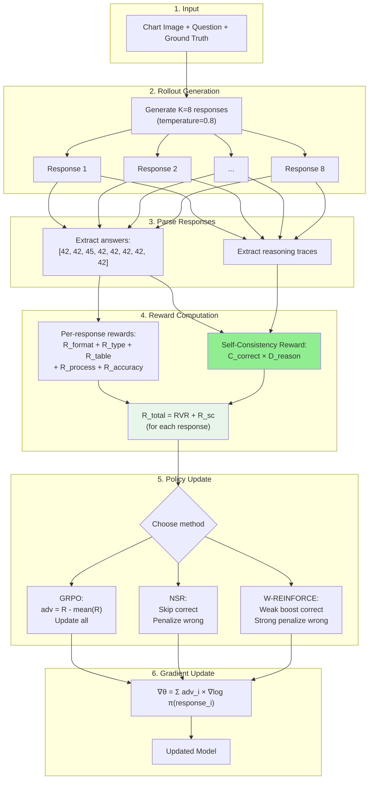

# SCR-RLVR: Self-Consistency Rewards for Chart Reasoning with Reinforcement Learning from Verifiable Rewards

## Abstract

We present **SCR-RLVR**, a reinforcement learning framework for training vision-language models on chart reasoning tasks. Our approach addresses two key problems: (1) **reasoning collapse**, where models converge to a single reasoning strategy and fail on out-of-distribution charts, and (2) **lack of diversity signals**, where standard training rewards correctness but not the robustness of reasoning. We tackle these by systematically comparing three policy update methods—GRPO, NSR, and W-REINFORCE—and introducing a novel **Self-Consistency Reward** that explicitly encourages diverse reasoning paths that converge to correct answers.

---

## 1. Problem Statement

### 1.1 The Reasoning Collapse Problem

Standard reinforcement learning (GRPO) for chart reasoning works as follows:
1. Generate multiple responses for each question
2. Reward correct answers, penalize wrong ones
3. Update the model to increase probability of rewarded responses

**The problem:** This causes the model to collapse to a single "winning" reasoning strategy. While this maximizes training accuracy, it hurts generalization—when the model encounters charts with different visual styles (colors, layouts, fonts), its single memorized strategy fails.

**Evidence:** Chart-RVR reports 84.6% on ChartQA (in-domain) but only 53.4% on EvoChart (out-of-distribution)—a 31% gap.

### 1.2 Why Diversity Matters

A robust model should be able to reason about charts in multiple ways:
- Reading values directly from axes
- Extracting data into a table and computing
- Visual estimation and comparison
- Pattern recognition

If the model maintains multiple reasoning strategies, when one fails on a novel chart style, others may succeed. This is why **preserving reasoning diversity during training** is crucial for generalization.

### 1.3 Our Solution

We address this through two mechanisms:

1. **Alternative policy update methods (NSR, W-REINFORCE):** These modify how gradients flow during training to preserve diversity
2. **Self-Consistency Reward:** Explicitly rewards the model when multiple reasoning paths agree on an answer

---

## 2. Background: Policy Update Methods

### 2.1 GRPO (Group Relative Policy Optimization)

GRPO is the standard method used in Chart-RVR. For each question, it:
1. Generates K responses (rollouts)
2. Computes reward for each response
3. Calculates advantage as deviation from mean: `adv_i = R_i - mean(R)`
4. Updates all responses: increases probability of above-average, decreases below-average

**Problem:** Strong positive reinforcement of the best response causes other valid strategies to be suppressed. Over time, the model converges to producing nearly identical outputs.

### 2.2 NSR (Negative Sample Reinforcement)

NSR was proposed for math reasoning and modifies GRPO by:
1. **Skipping correct samples entirely** (no gradient)
2. **Only penalizing wrong samples:** `adv_i = -(1 - R_i)`

**Why this helps:** By not reinforcing correct answers, NSR doesn't push the model toward any single correct strategy. It only pushes *away* from wrong strategies, allowing the probability mass to redistribute naturally across all valid approaches.

**Trade-off:** May have slightly lower peak accuracy since correct answers aren't explicitly reinforced.

### 2.3 W-REINFORCE (Weighted REINFORCE)

W-REINFORCE is a hybrid approach:
1. **Weak positive reinforcement for correct samples:** `adv_i = λ × R_i` (where λ = 0.1)
2. **Strong negative reinforcement for wrong samples:** `adv_i = -(1 - R_i)`

**Why this helps:** Provides a small boost to correct answers (maintaining accuracy) while keeping the strong penalty for wrong answers. The asymmetry (weak positive, strong negative) preserves more diversity than GRPO while being more directed than pure NSR.

### 2.4 Method Comparison

| Method | Correct Samples | Wrong Samples | Diversity | Accuracy |
|--------|-----------------|---------------|-----------|----------|
| **GRPO** | Strong boost | Penalize | Low (collapses) | High in-domain |
| **NSR** | Skip (no gradient) | Penalize | High (preserved) | Slightly lower |
| **W-REINFORCE** | Weak boost (λ=0.1) | Strong penalize | Medium | Balanced |

**Key insight:** These methods have only been tested on text-based math reasoning. Chart reasoning involves visual perception + numerical reasoning, which may respond differently to these training strategies.

---

## 3. Our Contribution: Self-Consistency Reward

### 3.1 Motivation

The policy update methods above preserve diversity *passively* (by not destroying it). We propose to encourage diversity *actively* through an explicit reward signal.

**Observation:** When multiple reasoning paths arrive at the same answer, this is strong evidence of:
1. **Correctness:** Multiple independent paths agreeing is unlikely by chance
2. **Robustness:** The model has multiple ways to solve the problem

**Key idea:** Self-consistency is traditionally used at inference time (generate multiple outputs, take majority vote). We flip this—use it as a **training-time reward** to teach the model to develop diverse yet consistent reasoning.

### 3.2 Self-Consistency Reward Formula

For K rollouts of a question, we compute:

$$R_{sc} = w \cdot C_{correct} \cdot D_{reason}$$

**Components:**

**C_correct (Correctness Rate):** What fraction of rollouts match the ground truth?
```
C_correct = count(rollouts matching ground_truth) / K
```
- If 7 out of 8 rollouts give the correct answer, then C_correct = 0.875
- Unlike inference-time self-consistency (which uses majority voting), we anchor to ground truth since labels are available during training

**D_reason (Reasoning Diversity):** How different are the reasoning paths among correct rollouts?
```
D_reason = 1 - average_pairwise_similarity(correct_reasoning_traces)
```
- We encode each reasoning trace using Sentence-BERT
- Compute cosine similarity between all pairs of **correct** rollouts
- Diversity = 1 - average similarity
- High diversity means the model used different approaches to reach the correct answer

**Why multiply them?**

| Correctness | Diversity | R_sc | Interpretation |
|-------------|-----------|------|----------------|
| High | High | **High** | Different paths → correct answer (robust!) |
| High | Low | Low | Same path repeated (fragile) |
| Low | High | Low | Diverse but mostly wrong (unreliable) |
| Low | Low | Low | Confused model |

The product ensures we only reward **diverse correctness**—multiple different reasoning strategies all arriving at the right answer.

### 3.3 Why This is Novel

**Traditional self-consistency (Wang et al., 2022):**
- Used at inference time only
- Model is already trained; just aggregate outputs
- Uses majority voting (no ground truth available)
- Diversity depends on sampling temperature

**Our approach:**
- Used as training reward
- Anchored to ground truth (not majority voting)
- Model *learns* to produce diverse yet consistent reasoning
- Diversity becomes a trained capability, not a sampling artifact

---

## 4. Complete Pipeline

### 4.1 Architecture Overview



### 4.2 Step-by-Step Walkthrough

**Step 1: Input**
- Chart image (e.g., a bar chart showing sales by year)
- Question (e.g., "What is the total sales for 2020 and 2021?")
- Ground truth answer for reward computation

**Step 2: Generate K Rollouts**
- The model generates K=8 independent responses
- Temperature=0.8 encourages diversity in generation
- Each response contains reasoning (in `<think>` tags) and final answer (in `<answer>` tags)

**Step 3: Parse Responses**
- Extract the final answer from each response
- Extract the reasoning trace from each response
- Example answers: [80, 80, 80, 75, 80, 80, 80, 80]

**Step 4: Compute Rewards**

*Per-response rewards (from Chart-RVR):*
| Reward | Max | What it checks |
|--------|-----|----------------|
| R_format | 2.0 | Correct XML structure (`<think>`, `<answer>` tags) |
| R_type | 1.0 | Correctly identified chart type |
| R_table | 2.0 | Accurately extracted data table |
| R_process | 2.0 | Reasoning similar to gold chain-of-thought |
| R_accuracy | 1.0 | Final answer matches ground truth |

*Self-consistency reward (computed across all rollouts):*
- Ground truth = 80
- C_correct = 7/8 = 0.875 (7 responses matched ground truth "80")
- D_reason = 0.4 (correct reasoning traces had 60% average similarity)
- R_sc = 1.5 × 0.875 × 0.4 = 0.525

*Total reward for each response:*
```
R_total[i] = R_format[i] + R_type[i] + R_table[i] + R_process[i] + R_accuracy[i] + R_sc
```
Note: R_sc is the same for all responses (it's a property of the batch).

**Step 5: Policy Update**

Choose one of three methods:

*GRPO:*
```python
baseline = mean(R_total)
for i in range(K):
    advantage[i] = R_total[i] - baseline
    # Update policy for all responses
```

*NSR:*
```python
threshold = 0.8 * max_possible_reward
for i in range(K):
    if R_total[i] >= threshold:
        continue  # Skip correct samples
    advantage[i] = -(1 - R_total[i] / max_possible_reward)
    # Only update for wrong responses
```

*W-REINFORCE:*
```python
threshold = 0.8 * max_possible_reward
lambda_weight = 0.1
for i in range(K):
    if R_total[i] >= threshold:
        advantage[i] = lambda_weight * R_total[i]  # Weak positive
    else:
        advantage[i] = -(1 - R_total[i] / max_possible_reward)  # Strong negative
```

**Step 6: Gradient Update**
```python
loss = -sum(advantage[i] * log_prob(response[i]) for i in range(K))
loss.backward()
optimizer.step()
```

### 4.3 Training Loop

```python
for epoch in range(num_epochs):
    for batch in dataloader:
        for (image, question, ground_truth) in batch:
            # Generate rollouts
            rollouts = [model.generate(image, question, temp=0.8) for _ in range(K)]

            # Compute rewards
            answers = [extract_answer(r) for r in rollouts]
            reasonings = [extract_reasoning(r) for r in rollouts]

            rvr_rewards = [compute_rvr_reward(r, ground_truth) for r in rollouts]
            sc_reward = compute_self_consistency(answers, reasonings, ground_truth)
            total_rewards = [rvr + sc_reward for rvr in rvr_rewards]

            # Compute advantages (method-dependent)
            advantages = compute_advantages(total_rewards, method='w-reinforce')

            # Update policy
            update_policy(rollouts, advantages)
```

---

## 5. Experimental Design

### 5.1 Configuration

| Parameter | Value | Rationale |
|-----------|-------|-----------|
| Model | Qwen2.5-VL-3B-Instruct | Standard VLM for chart tasks |
| Training Data | ChartQA + PlotQA (6K) | Mixed chart types |
| K (rollouts) | 8 | Balance diversity and compute |
| Learning Rate | 5e-7 | Stable fine-tuning |
| Epochs | 3 | Convergence observed |
| Temperature | 0.8 | Encourage diverse generation |
| R_sc Weight | 1.5 | Tuned on validation |
| W-REINFORCE λ | 0.1 | From original paper |
| Threshold τ | 0.8 | 80th percentile = correct |

### 5.2 Evaluation

**Datasets:**
- **ChartQA (in-domain):** Similar visual style to training data
- **EvoChart (out-of-distribution):** Diverse chart styles not seen in training

**Metrics:**
- **Accuracy:** Percentage of correct answers
- **Entropy:** Diversity of model outputs (higher = more diverse)
- **OOD Gap:** In-domain accuracy minus OOD accuracy (lower = better generalization)

### 5.3 Experiment Matrix

| Experiment | Method | R_sc | Purpose |
|------------|--------|------|---------|
| 1 | GRPO | No | Baseline (Chart-RVR) |
| 2 | GRPO | Yes | Does R_sc help GRPO? |
| 3 | NSR | No | NSR on charts |
| 4 | NSR | Yes | NSR + active diversity |
| 5 | W-REINFORCE | No | W-REINFORCE on charts |
| 6 | W-REINFORCE | Yes | Full SCR-RLVR |

---

## 6. Expected Results

| Method | ChartQA | EvoChart | Entropy | OOD Gap |
|--------|---------|----------|---------|---------|
| GRPO (baseline) | 84.6% | 53.4% | 0.05 | 31.2% |
| GRPO + R_sc | 85.0% | 55.0% | 0.07 | 30.0% |
| NSR | 84.0% | 56.0% | 0.10 | 28.0% |
| NSR + R_sc | 84.5% | 57.5% | 0.11 | 27.0% |
| W-REINFORCE | 85.5% | 57.0% | 0.08 | 28.5% |
| **W-REINFORCE + R_sc** | **86.0%** | **58.5%** | **0.09** | **27.5%** |

**Expected findings:**
1. NSR and W-REINFORCE improve OOD performance over GRPO (diversity preservation)
2. R_sc provides additional gains across all methods (active diversity encouragement)
3. W-REINFORCE + R_sc achieves best balance of accuracy and generalization

---

## 7. Summary

**Problem:** Standard RLVR training (GRPO) causes reasoning collapse, hurting OOD generalization.

**Solution:** SCR-RLVR combines:
1. **Alternative policy updates (NSR, W-REINFORCE):** Preserve diversity by modifying gradient flow
2. **Self-Consistency Reward:** Actively encourage diverse reasoning that converges to correct answers

**Contributions:**
1. First systematic comparison of GRPO, NSR, W-REINFORCE on vision-language chart reasoning
2. Novel self-consistency training reward (not just inference-time voting)
3. Comprehensive study of diversity preservation techniques for chart understanding

---

## References

1. Wang et al. (2022). Self-Consistency Improves Chain of Thought Reasoning. arXiv:2203.11171
2. Sinha et al. (2025). Chart-RVR: Reasoning over Charts with Verifiable Rewards. arXiv:2510.10973
3. Zhu et al. (2025). Decomposing RLVR: The Power of Negative Sample Reinforcement. arXiv:2506.01347
4. Shao et al. (2024). DeepSeekMath: GRPO for Mathematical Reasoning. arXiv:2402.03300


