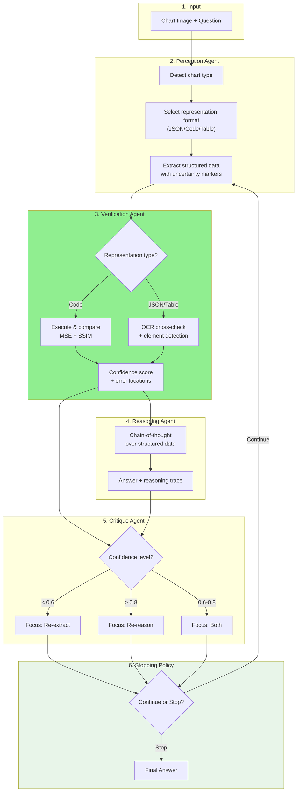

# TTMA-ChartQA: Test-Time Multi-Agent Reinforcement Learning for Chart Question Answering

## Abstract

We present **TTMA-ChartQA**, an inference-time framework for chart question answering that requires **zero training**. Our approach addresses two key problems: (1) **expensive fine-tuning**, where existing methods require thousands of training samples and significant GPU resources, and (2) **limited accessibility**, where training-based methods cannot be applied to proprietary API models (GPT-4V, Gemini). We tackle these by introducing a multi-agent pipeline with iterative verification-guided refinement and a learned stopping policy that scales compute at inference time.

---

## 1. Problem Statement

### 1.1 The Training Bottleneck Problem

Current chart reasoning solutions rely on expensive fine-tuning:
1. Chart-RVR requires 6k training samples
2. Training 3B+ parameter models needs 24GB+ GPUs
3. Cannot apply to closed-source API models (GPT-4V, Gemini, Claude)
4. Performance degrades significantly with <1k training samples

**The problem:** Most practitioners cannot access this level of resources, limiting the deployment of advanced chart reasoning.

**Evidence:** Chart-RVR achieves 84.6% on ChartQA but requires full fine-tuning infrastructure that most researchers don't have.

### 1.2 Why Inference-Time Scaling Matters

Test-time compute scaling has shown success in:
- Text reasoning (o1/o3 models)
- Math problem solving (various approaches)
- Chart generation (METAL - ACL 2025)

**But no existing work applies test-time RL to chart understanding/question answering.**

A robust inference-time approach enables:
- Using any VLM (API or local) without modification
- Scaling compute based on question difficulty
- Democratizing advanced reasoning for resource-constrained practitioners

### 1.3 Our Solution

We address this through three mechanisms:

1. **Multi-Agent Architecture:** Specialized agents for perception, verification, reasoning, and critique
2. **Iterative Refinement:** Verification-guided loops that refine both extraction AND reasoning
3. **Test-Time RL:** Learned policy for adaptive iteration (when to stop vs. continue)

---

## 2. Background: Existing Approaches

### 2.1 Direct VLM (Baseline)

The simplest approach sends the chart image + question directly to a vision-language model:

```
Input: [Chart Image] + "What is the total sales for 2020?"
Output: "The total sales for 2020 is 42 million."
```

**Problem:** VLMs make perceptual errors (misread axis values, confuse chart types) and reasoning errors (wrong calculations) without any verification.

### 2.2 DePlot-Style Pipeline

DePlot converts charts to structured data before reasoning:
1. Extract chart → structured table (one-shot)
2. LLM reasons over the table

**Problem:** Single-pass extraction has no error correction. If extraction fails, reasoning cannot recover.

### 2.3 Self-Consistency

Generate multiple answers and take majority vote:
1. Sample K=5 answers with temperature
2. Take most frequent answer

**Problem:** Multiple attempts with the same flawed perception don't fix systematic errors.

### 2.4 Method Comparison

| Method | Fixes Perception Errors | Fixes Reasoning Errors | Adapts to Difficulty |
|--------|------------------------|----------------------|---------------------|
| **Direct VLM** | ❌ | ❌ | ❌ |
| **DePlot** | ❌ | ❌ | ❌ |
| **Self-Consistency** | Partial | Partial | ❌ |
| **TTMA-ChartQA (Ours)** | ✅ | ✅ | ✅ |

**Key insight:** No existing inference-time method distinguishes between perception errors (extraction) and reasoning errors (calculation), or adapts compute based on difficulty.

---

## 3. Our Contribution: Multi-Agent Iterative Framework

### 3.1 System Overview

Our framework consists of **four specialized agents** working in an **iterative refinement loop**:

```
Chart Image + Question
        ↓
[1] Perception Agent → Structured Representation
        ↓
[2] Verification Agent → Confidence Score + Error Localization
        ↓
[3] Reasoning Agent → Answer + Reasoning Trace
        ↓
[4] Critique Agent → Targeted Feedback
        ↓
    ← Iterative Loop (1-5 rounds) ←
        ↓
    Final Answer
```

### 3.2 The Four Agents

**Agent 1: Perception Agent**
- **Role:** Convert chart image to structured format
- **Output:** JSON, Python code, or markdown table (adaptively chosen)
- **Key feature:** Includes uncertainty markers ("value ≈42 ± 2, axis partially occluded")

**Agent 2: Verification Agent**
- **Role:** Validate extraction accuracy
- **Methods:**
  - For code: Execute and compare rendered output to original (MSE + SSIM)
  - For JSON/tables: Cross-check values via OCR
- **Output:** Confidence score (0-1) + specific error locations

**Agent 3: Reasoning Agent**
- **Role:** Answer question using structured data
- **Input:** Structured representation + question
- **Output:** Answer + step-by-step reasoning trace

**Agent 4: Critique Agent**
- **Role:** Generate targeted feedback for refinement
- **Decision logic:**
  - If verification_confidence < 0.6 → "Re-extract data (perception error)"
  - If verification_confidence > 0.8 but answer wrong → "Re-reason (extraction OK)"
- **Output:** Specific refinement instructions

### 3.3 Why Multi-Agent Helps

| Failure Type | Single Agent | Multi-Agent (Ours) |
|--------------|-------------|-------------------|
| Misread axis value | Cannot detect | Verification catches via OCR cross-check |
| Wrong calculation | Cannot isolate | Critique identifies reasoning step failure |
| Chart type confusion | Compounds errors | Verification confidence drops, triggers re-extraction |
| Partial occlusion | Silent failure | Uncertainty markers enable targeted retry |

**Key insight:** Separating perception, verification, reasoning, and critique allows **targeted error correction** instead of blind retrying.

---

## 4. Iterative Refinement with Verification Feedback

### 4.1 The Refinement Loop

```python
for iteration in range(max_iterations):
    # Extract
    representation = perception_agent(chart_image, critique_feedback)

    # Verify
    confidence, errors = verification_agent(representation, chart_image)

    # Reason
    answer, reasoning = reasoning_agent(representation, question)

    # Check stopping condition
    if confidence > 0.85 AND answer_consistent_with_previous:
        return answer

    # Critique (decide what to fix)
    critique_feedback = critique_agent(representation, confidence, errors, answer)
```

### 4.2 Targeted Refinement Strategy

The critique agent chooses **what to fix**:

| Verification Confidence | Critique Decision | Action |
|------------------------|-------------------|--------|
| < 0.6 | "Perception error" | Re-extract with focus on error location |
| 0.6 - 0.8 | "Uncertain" | Re-extract AND re-reason |
| > 0.8 but wrong answer | "Reasoning error" | Keep extraction, re-reason with emphasis |

**Example:**
```
Iteration 1: Extracted y-axis max = 100, Verification confidence = 0.45
Critique: "Y-axis values mismatch OCR. Re-extract with focus on y-axis labels."

Iteration 2: Extracted y-axis max = 150, Verification confidence = 0.92
Critique: "Extraction looks correct. Proceed with reasoning."
→ Final answer generated with high confidence.
```

### 4.3 Why This is Novel

**RECODE (2025):** Iterative refinement of code reconstruction using MSE only
- Only refines rendering, not reasoning

**Our approach:** Verification-guided refinement of BOTH extraction AND reasoning
- Distinguishes perception vs. reasoning errors
- Uses targeted feedback, not blind retrying

---

## 5. Test-Time Reinforcement Learning

### 5.1 Motivation

Different questions need different amounts of compute:
- Simple retrieval ("What is the 2020 value?") → 1 iteration
- Complex computation ("What is the CAGR from 2018-2022?") → 3+ iterations

**Goal:** Learn when to stop iterating vs. continue refining.

### 5.2 Adaptive Iteration Policy

We train a small policy network to decide continue/stop:

**State representation:**
```python
state = [
    iteration_count / 5.0,      # Normalized iteration
    verification_confidence,     # How reliable is extraction?
    answer_entropy,              # How uncertain is the answer?
    question_complexity,         # Estimated difficulty
]
```

**Policy network:**
```
state → MLP(32 hidden) → [P(continue), P(stop)]
```

**Training signal:** Using a small validation set (100 samples):
```python
for sample in validation_set:
    for n in [1, 2, 3, 4, 5]:
        accuracy = run_pipeline(sample, max_iterations=n)
        reward = accuracy - 0.1 * n  # Accuracy minus cost penalty

    optimal_n = argmax(rewards)
    train_policy(features, optimal_n)
```

### 5.3 Reward Function

$$R = \text{correctness} \times \text{confidence} - \lambda \times \text{iterations}$$

| Component | Meaning |
|-----------|---------|
| correctness | 1 if answer correct, 0 otherwise |
| confidence | Verification confidence (0-1) |
| λ | Cost penalty weight (default: 0.1) |
| iterations | Number of iterations used |

**Interpretation:** The policy learns to stop early when confidence is high, and continue when uncertain—balancing accuracy vs. compute cost.

### 5.4 Why This is Novel

**TTRL (2024):** Test-time RL for text/code reasoning
- Does not handle visual input

**METAL (2025):** Test-time scaling for chart generation
- Does generation, not understanding

**Our contribution:** First test-time RL for chart question answering
- Policy operates over visual verification confidence
- Adapts compute to question difficulty

---

## 6. Complete Pipeline

### 6.1 Architecture Overview



### 6.2 Step-by-Step Walkthrough

**Step 1: Input**
- Chart image (e.g., a bar chart showing sales by year)
- Question (e.g., "What is the total sales for 2020 and 2021?")

**Step 2: Perception Agent**
- Detects chart type: bar chart
- Selects representation: JSON
- Extracts data:
```json
{
  "chart_type": "bar",
  "x_axis": {"label": "Year", "values": [2020, 2021, 2022]},
  "y_axis": {"label": "Sales ($M)", "range": [0, 150]},
  "data": [
    {"year": 2020, "value": 80, "confidence": 0.95},
    {"year": 2021, "value": 100, "confidence": 0.90},
    {"year": 2022, "value": 120, "confidence": "approximate"}
  ]
}
```

**Step 3: Verification Agent**
- OCR cross-check: Values match text in image
- Element detection: 3 bars detected, 3 data points extracted
- Confidence: 0.87
- Errors: None

**Step 4: Reasoning Agent**
```
Question: What is the total sales for 2020 and 2021?

Step 1: Need values for 2020 and 2021
Step 2: 2020 = 80, 2021 = 100
Step 3: Total = 80 + 100 = 180
Answer: 180 million dollars
```

**Step 5: Critique Agent**
- Verification confidence: 0.87 (high)
- Answer derived from correct data
- Critique: "Extraction and reasoning appear correct."

**Step 6: Stopping Policy**
- State: [iteration=1, confidence=0.87, entropy=low, complexity=easy]
- Decision: STOP
- Final answer: 180 million dollars

### 6.3 Handling Errors (Example)

**Iteration 1:**
- Perception extracts y-axis max as 100 (incorrect, actually 150)
- Verification confidence: 0.52 (OCR mismatch detected)
- Critique: "Y-axis values inconsistent with OCR. Re-extract focusing on axis labels."

**Iteration 2:**
- Perception re-extracts with focus on y-axis
- Correct values extracted (max = 150)
- Verification confidence: 0.91
- Reasoning proceeds correctly
- Policy: STOP

---

## 7. Experimental Design

### 7.1 Configuration

| Parameter | Value | Rationale |
|-----------|-------|-----------|
| VLM (Perception) | GPT-4V or Qwen2.5-VL-3B | API or local option |
| LLM (Reasoning) | GPT-4 Turbo or LLaMA 3.1 8B | API or local option |
| Max Iterations | 5 | Balance quality vs. cost |
| Policy Training Set | 100 samples | Learn stopping criteria |
| Verification Threshold | 0.85 | High confidence = stop |
| Cost Penalty (λ) | 0.1 | Tune accuracy-cost tradeoff |

### 7.2 Evaluation

**Datasets:**
- **ChartQA (in-domain):** 1,500 test samples, standard benchmark
- **EvoChart (out-of-distribution):** 600 samples, tests generalization

**Metrics:**
- **Accuracy:** Percentage of correct answers
- **Iterations Used:** Average iterations per question
- **Cost:** API cost per sample ($/sample)
- **Breakdown:** By chart type, by question type

### 7.3 Experiment Matrix

| Experiment | Method | Purpose |
|------------|--------|---------|
| 1 | Direct VLM | Baseline (no structure) |
| 2 | DePlot-style | One-shot extraction baseline |
| 3 | Self-Consistency (K=5) | Test-time baseline |
| 4 | TTMA (N=1) | Our method, single iteration |
| 5 | TTMA (N=3 fixed) | Our method, fixed iterations |
| 6 | TTMA (adaptive) | Full method with learned policy |

---

## 8. Expected Results

| Method | ChartQA | EvoChart | Cost ($/sample) | Iterations |
|--------|---------|----------|-----------------|------------|
| Direct VLM (baseline) | 78% | 52% | $0.02 | 1 |
| DePlot-style | 83% | 57% | $0.04 | 1 |
| Self-Consistency (K=5) | 82% | 55% | $0.10 | 1 |
| TTMA (N=1) | 83% | 58% | $0.04 | 1 |
| TTMA (N=3 fixed) | 87% | 63% | $0.12 | 3 |
| **TTMA (adaptive)** | **89%** | **65%** | **$0.08** | **2.1 avg** |

**Expected findings:**
1. Multi-agent structure improves over direct VLM (+5% from structured extraction)
2. Iterative refinement adds further gains (+4% from verification feedback)
3. Adaptive policy achieves best accuracy while reducing average iterations
4. Cost-effective: +11% accuracy for only +$0.06/sample vs. baseline

---

## 9. Summary

**Problem:** Training-based chart reasoning requires expensive fine-tuning and cannot use proprietary API models.

**Solution:** TTMA-ChartQA combines:
1. **Multi-Agent Architecture:** Specialized perception, verification, reasoning, and critique agents
2. **Iterative Refinement:** Verification-guided loops that fix both extraction AND reasoning errors
3. **Test-Time RL:** Learned policy that adapts compute to question difficulty

**Contributions:**
1. First test-time RL framework for chart question answering
2. Multi-agent architecture that distinguishes perception vs. reasoning errors
3. Verification-guided iterative refinement with targeted feedback
4. Zero-training deployment accessible to all practitioners

---

## References

1. Liu et al. (2023). DePlot: One-shot Chart-to-Table. arXiv:2212.10505
2. Li et al. (2025). METAL: Multi-Agent Framework for Chart Generation. ACL 2025
3. Wang et al. (2022). Self-Consistency Improves Chain of Thought Reasoning. arXiv:2203.11171
4. Sinha et al. (2025). Chart-RVR: Reasoning over Charts with Verifiable Rewards. arXiv:2510.10973
5. Xia et al. (2025). RECODE: Iterative Code-Based Chart Reconstruction. arXiv:2510.13756


