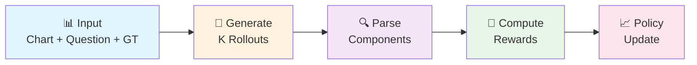
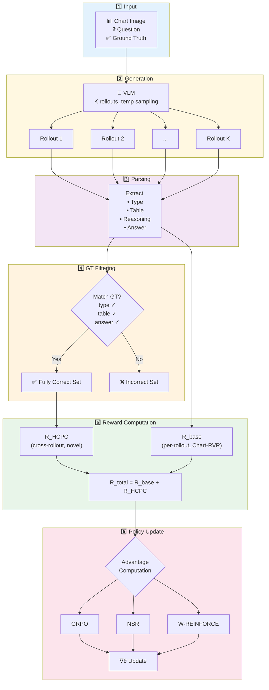
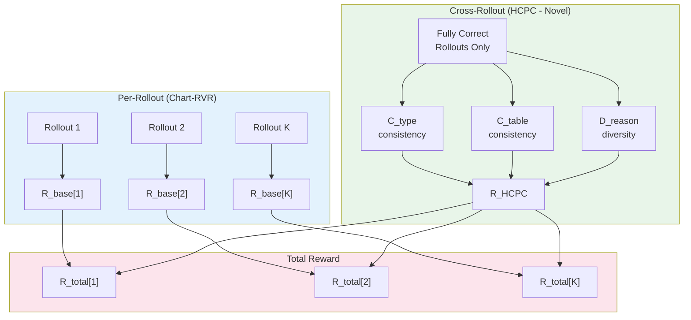
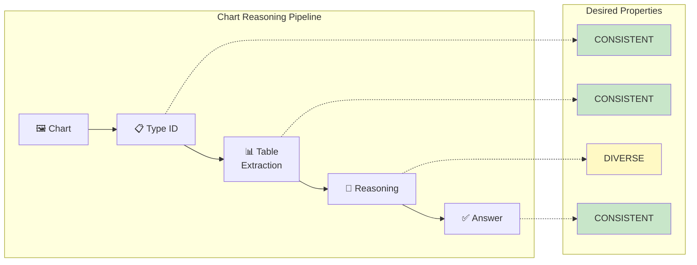
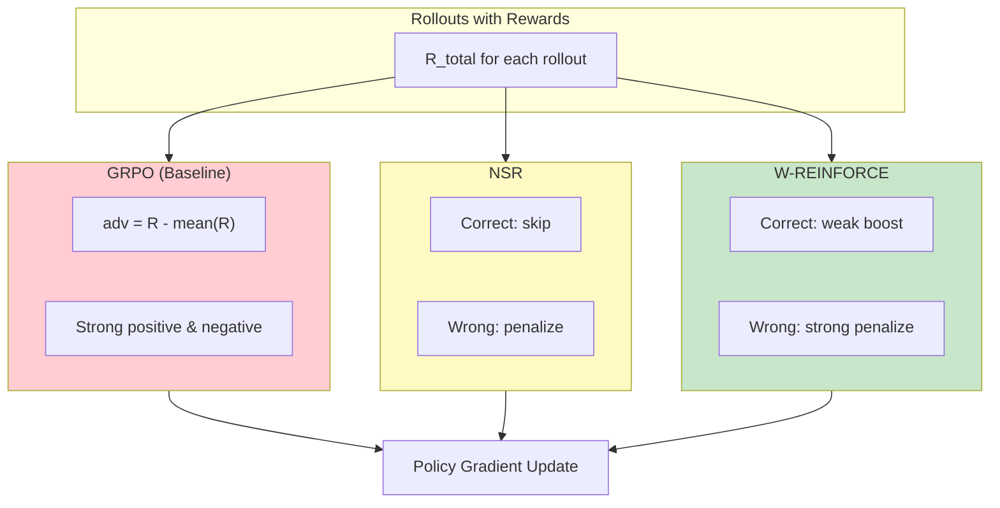
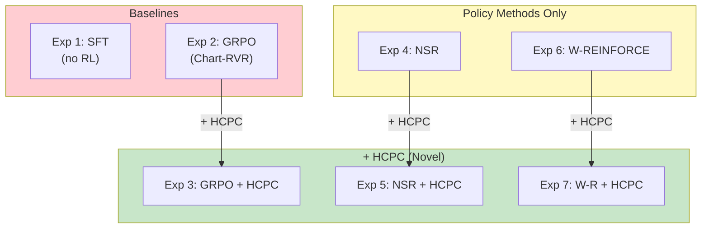
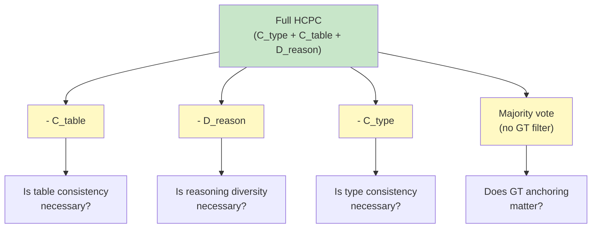
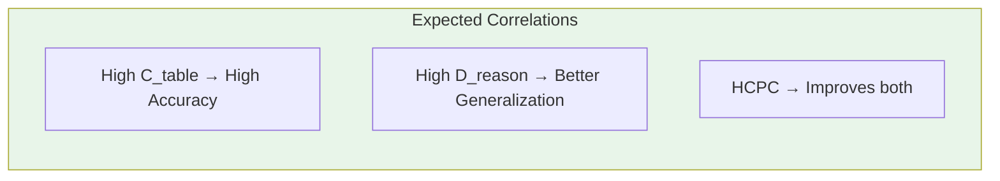

# HCPC-RLVR: Hierarchical Correct-Path Consistency for Robust Chart Reasoning
## Slide Deck

---

## Slide 12: Step-by-Step Training Flow

### Training Pipeline Overview



### Detailed Steps

| Step | Action | Output |
|------|--------|--------|
| **1. Input** | Chart image + Question + Ground truth (type, table, answer) | Training sample |
| **2. Generation** | Generate K rollouts with temperature sampling | K candidate responses |
| **3. Parsing** | Extract type, table, reasoning, answer from each rollout | Structured components |
| **4. Filtering** | Identify fully correct rollouts (match GT type, table, answer) | Correct set for HCPC |
| **5. Rewards** | Compute R_base + R_HCPC | Per-sample total reward |
| **6. Advantages** | Method-dependent (GRPO/NSR/W-REINFORCE) | Gradient weights |
| **7. Update** | Policy gradient step | Updated model θ |

### Visual Flow (Mermaid)



---

## Slide 13: Reward Computation

### Two Reward Components

#### 1. Base Reward (R_base) — Per-Rollout (from Chart-RVR)
```
R_base = R_format + R_type + R_table + R_process + R_accuracy
```

#### 2. HCPC Reward (R_HCPC) — Cross-Rollout (Novel, Ours)
**Computed only among ground-truth-correct rollouts:**

```
R_HCPC = (|fully_correct| / K) × (w₁·C_type + w₂·C_table + w₃·D_reason)
```

| Component | What it measures | Goal |
|-----------|------------------|------|
| C_type | Fraction of correct rollouts with same chart type | HIGH (consistency) |
| C_table | Avg pairwise similarity of extracted tables | HIGH (consistency) |
| D_reason | 1 - avg pairwise similarity of reasoning traces | HIGH (diversity) |

### Total Reward
```
R_total[i] = R_base[i] + R_HCPC
```

### Reward Flow Diagram



---

## Slide 14: Why Level-Specific Objectives?

### The Key Insight

| Level | Task | Desired Property | Rationale |
|-------|------|------------------|-----------|
| **Perception** | Identify chart type | CONSISTENT | One correct type exists |
| **Extraction** | Parse data table | CONSISTENT | One correct table exists |
| **Reasoning** | Compute/analyze | DIVERSE | Multiple valid strategies |
| **Answer** | Final response | CONSISTENT | One correct answer |

### HCPC Reward Interpretation

| C_table | D_reason | Meaning |
|---------|----------|---------|
| High | High | Same data, different strategies → **Robust!** |
| High | Low | Same data, same strategy → Fragile |
| Low | High | Different data → Lucky guesses |
| Low | Low | Confused model |

### Level-Specific Objectives Diagram



---

## Slide 15: Policy Update Methods

### Three Methods We Will Compare

#### GRPO (Group Relative Policy Optimization) - Baseline
```
advantage[i] = R_total[i] - mean(R_total)
```
- Boosts above-average rollouts
- Penalizes below-average rollouts
- Known issue: causes collapse to single strategy

#### NSR (Negative Sample Reinforcement)
```
If correct: advantage[i] = 0  (skip)
If wrong:   advantage[i] = -(1 - R_total[i])
```
- Preserves diversity by not reinforcing any single path
- Trade-off: may have lower peak accuracy

#### W-REINFORCE (Weighted REINFORCE)
```
If correct: advantage[i] = λ × R_total[i]     (λ = 0.1, weak)
If wrong:   advantage[i] = -(1 - R_total[i])  (strong)
```
- Balanced approach
- Weak positive + strong negative

### Policy Methods Comparison



---

## Slide 16: Experimental Setup

### What We Will Use

#### Model
- **Qwen2.5-VL-3B-Instruct** (same as Chart-RVR for fair comparison)

#### Datasets (from Chart-RVR)

| Dataset | Split | Size | Purpose |
|---------|-------|------|---------|
| **ChartQA** | Train | ~18K | Training |
| **ChartQA** | Test | ~2.5K | In-domain evaluation |
| **PlotQA** | Train | Subset | Additional training data |

#### Hyperparameters (To Be Tuned)

| Parameter | Planned Range |
|-----------|---------------|
| K (rollouts) | 4, 8 |
| Temperature | 0.7, 0.8, 1.0 |
| Learning Rate | 1e-6, 5e-7 |
| HCPC weights (w₁, w₂, w₃) | To be determined |
| λ (W-REINFORCE) | 0.1 (from paper) |

---

## Slide 17: Experiment Matrix

### What We Plan to Run

#### Main Experiments: 3 Policies × 2 Reward Settings = 6 Experiments

| Exp | Policy | Reward | Purpose |
|-----|--------|--------|---------|
| **1** | SFT | - | Baseline (no RL) |
| **2** | GRPO | Chart-RVR only | Replicate Chart-RVR baseline |
| **3** | GRPO | Chart-RVR + HCPC | Effect of HCPC on GRPO |
| **4** | NSR | Chart-RVR only | NSR on chart reasoning |
| **5** | NSR | Chart-RVR + HCPC | NSR + HCPC |
| **6** | W-REINFORCE | Chart-RVR only | W-REINFORCE on chart reasoning |
| **7** | W-REINFORCE | Chart-RVR + HCPC | Full method |

### Experiment Matrix Diagram



---

## Slide 18: Research Questions

### What We Want to Answer

| RQ | Question | How We'll Answer |
|----|----------|------------------|
| **RQ1** | Does HCPC improve over base Chart-RVR rewards? | Compare Exp 2 vs 3, 4 vs 5, 6 vs 7 |
| **RQ2** | Do NSR/W-REINFORCE preserve diversity better than GRPO? | Measure D_reason across methods |
| **RQ3** | Does diversity (D_reason) correlate with OOD performance? | Correlation analysis |
| **RQ4** | Does extraction consistency (C_table) correlate with accuracy? | Correlation analysis |
| **RQ5** | Which combination works best? | Compare all 7 experiments |

### What We Expect to Observe

1. **HCPC should help**: Adding cross-rollout consistency/diversity signals should improve over per-rollout rewards alone
2. **NSR/W-REINFORCE should preserve diversity**: Less collapse than GRPO
3. **Trade-offs**: Higher diversity might mean slightly lower in-domain accuracy but better generalization

---

## Slide 19: Planned Ablations

### Ablation Studies We Will Run

| Ablation | What We Remove | Question |
|----------|----------------|----------|
| **A1** | Remove C_table from HCPC | Is extraction consistency necessary? |
| **A2** | Remove D_reason from HCPC | Is reasoning diversity necessary? |
| **A3** | Remove C_type from HCPC | Is type consistency necessary? |
| **A4** | Use majority vote instead of GT filtering | Does GT-anchoring matter? |
| **A5** | Vary K (4 vs 8 rollouts) | How many rollouts are needed? |
| **A6** | Vary HCPC weights | Optimal w₁, w₂, w₃? |

### Ablation Diagram



---

## Slide 20: Metrics We Will Report

### Primary Metrics

| Metric | What It Measures |
|--------|------------------|
| **ChartQA Accuracy** | In-domain performance |
| **Relaxed Accuracy** | Standard chart QA metric (allows small numeric errors) |

### Secondary Metrics (for Analysis)

| Metric | What It Measures |
|--------|------------------|
| **C_table** | Extraction consistency among correct rollouts |
| **D_reason** | Reasoning diversity among correct rollouts |
| **C_type** | Type identification consistency |
| **Entropy** | Policy entropy (diversity measure) |

### What We Hope to Show



---

## Slide 21: Expected Outcomes

### What We Expect to Find

#### Scenario 1: HCPC Works
- GRPO + HCPC > GRPO alone
- NSR/W-REINFORCE + HCPC shows best balance
- C_table correlates with accuracy
- D_reason correlates with robustness

#### Scenario 2: Policy Method Matters More
- NSR/W-REINFORCE > GRPO regardless of HCPC
- HCPC provides marginal additional gains

#### Scenario 3: Neither Helps Much
- All methods similar to baseline
- Need to rethink approach

### We Will Report Honestly

Whatever results we get, we will analyze:
- What worked and what didn't
- Why certain combinations succeeded/failed
- Limitations of the approach

---

## Slide 22: Summary

### What We're Planning

1. **Dataset**: ChartQA (from Chart-RVR)
2. **Model**: Qwen2.5-VL-3B-Instruct
3. **Baselines**: SFT, GRPO with Chart-RVR rewards
4. **Novel Contribution**: HCPC reward (cross-rollout consistency + diversity)
5. **Policy Methods**: GRPO, NSR, W-REINFORCE
6. **Experiments**: 7 main experiments + ablations

### Key Questions We'll Answer

1. Does HCPC improve chart reasoning?
2. Do NSR/W-REINFORCE preserve diversity?
3. Which combination works best?
4. What are the trade-offs?

### Timeline

| Phase | Tasks |
|-------|-------|
| **Phase 1** | Implement HCPC reward, run baselines |
| **Phase 2** | Run all 7 experiments |
| **Phase 3** | Ablation studies |
| **Phase 4** | Analysis and writing |

---

*End of Slides*
